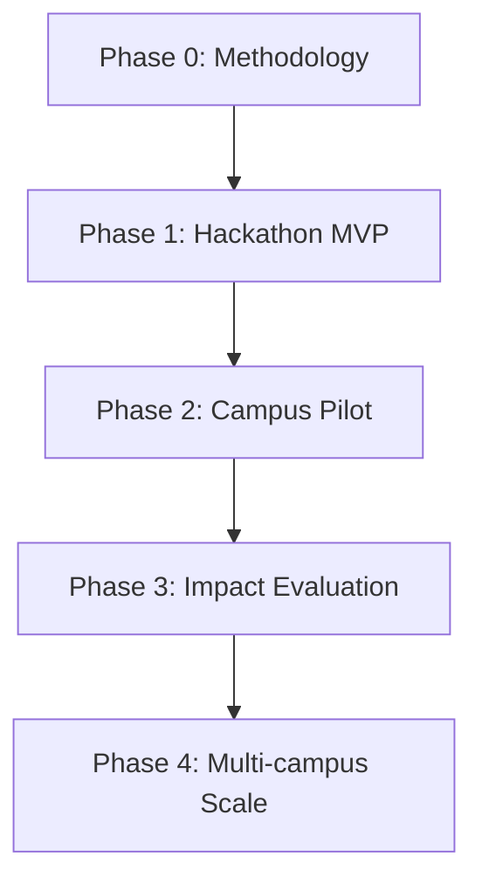
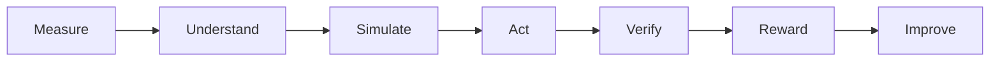

# CarbonLoop — Phase Roadmap

> **Measure. Verify. Reduce.**

CarbonLoop is an evidence-backed campus decarbonization platform for Indian universities. It connects individual activities to verified evidence, reproducible carbon calculations, sustained-reduction rewards, and privacy-safe institutional reporting.

## Source documents

- [[CarbonLoop_Final_Project]]
- [[CarbonLoop_Architecture]]

## Development path

## Phase notes

1. [[Phase 0 - Methodology and Setup]]
2. [[Phase 1 - Hackathon MVP]]
3. [[Phase 2 - Campus Pilot]]
4. [[Phase 3 - Impact Evaluation]]
5. [[Phase 4 - Multi-campus Scale]]

## Approved technical direction

- Next.js PWA with TypeScript
- Tailwind CSS and shadcn/ui
- Supabase PostgreSQL, Auth, Storage, and Row-Level Security
- Deterministic TypeScript carbon-calculation engine
- OCR with a replaceable multimodal-model fallback
- Server-side verification and append-only reward events
- Recharts or Observable Plot
- Vitest and Playwright
- Vercel deployment
- Sentry and OpenTelemetry

> [!important]
> The MVP is a modular monolith with PostgreSQL as its single authoritative system of record. Neo4j, InfluxDB, Redis, Qdrant, blockchain, federated learning, and direct UPI ingestion are deliberately excluded until a measured need exists.

## Product loop

## Overall success criteria

- [ ] Every displayed CO2e value can be traced to an activity, factor version, and calculation method.
- [ ] Users cannot issue their own verified evidence or reward points.
- [ ] Cross-user and cross-campus data access is blocked.
- [ ] Dashboards distinguish verified, corroborated, estimated, and rejected records.
- [ ] Small cohorts are suppressed automatically.
- [ ] Duplicate submissions cannot create duplicate rewards.
- [ ] OCR failure has a manual fallback.
- [ ] The three-person Hivemind team can deploy, monitor, and explain the system.

