# CarbonLoop — System Architecture

> **Architecture goal:** Build an evidence-backed campus decarbonization platform that is credible, secure, explainable, and feasible for a three-member team.

**Architecture style:** Modular monolith  
**Primary system of record:** PostgreSQL  
**Initial deployment:** Vercel + Supabase  
**Primary clients:** Student PWA and institutional dashboard  
**Related project note:** [[CarbonLoop_Final_Project]]

---

## 1. Architecture Decision

CarbonLoop will begin as a **modular monolith**, not a microservice or five-database system. One TypeScript application contains independently testable business modules while PostgreSQL remains the authoritative source of truth.

This choice gives the team:

- One codebase and one deployment workflow
- Transactional consistency between verification, calculations, and rewards
- Less infrastructure cost and fewer synchronization failures
- Clear module boundaries that can later become services if measured scale requires it
- A realistic path from hackathon demo to campus pilot

### Core principles

1. Carbon calculations are deterministic; an LLM never performs final arithmetic.
2. Every result retains its factor, source, version, method, and evidence quality.
3. Verification and reward issuance happen only on the server.
4. PostgreSQL is the single source of truth.
5. Personal evidence is private; institutional views use privacy-safe aggregates.
6. AI/OCR providers are replaceable adapters, not the center of the system.
7. Advanced infrastructure is added only after a measured bottleneck appears.

---

## 2. System Context

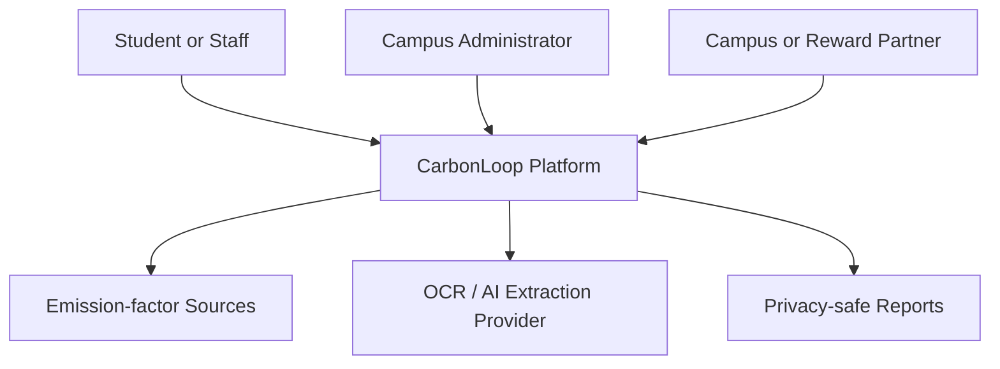

### Actors

| Actor | Main actions | Data visibility |
| --- | --- | --- |
| Student or staff | Baseline, activities, evidence, simulations, rewards | Own records only |
| Campus administrator | Interventions, aggregate trends, reports | Institution aggregates by default |
| Evidence issuer | Issues shuttle, meter, or vendor evidence | Its own issued events |
| Reward partner | Funds or fulfils approved benefits | Minimum required reward information |
| Platform operator | Maintains methodology and system health | Audited privileged access |

---

## 3. High-Level Architecture

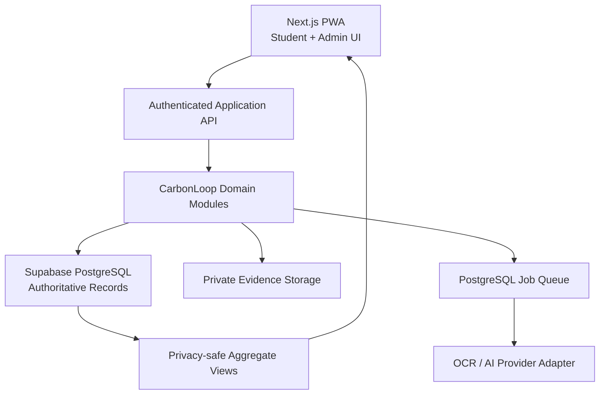

### Technology map

| Layer | Technology | Responsibility |
| --- | --- | --- |
| User interface | Next.js, TypeScript, Tailwind CSS, shadcn/ui | Responsive student and administrator PWA |
| Server/API | Next.js server routes or TypeScript service | Authentication, authorization, orchestration |
| Schema validation | Zod | Validate API inputs, extraction output, and calculations |
| Database | Supabase PostgreSQL | Authoritative transactional and analytical data |
| Authentication | Supabase Auth | Identity and session lifecycle |
| Authorization | PostgreSQL Row-Level Security | User, campus, tenant, and role isolation |
| Evidence storage | Supabase Storage | Private bills, receipts, and supporting files |
| Calculation engine | Pure TypeScript module | Deterministic, versioned CO2e calculations |
| Extraction | OCR with multimodal-model fallback | Converts documents into proposed structured fields |
| Background work | PostgreSQL-backed job table | Extraction, aggregate refresh, and report generation |
| Visualizations | Recharts or Observable Plot | Trends, comparisons, uncertainty, evidence coverage |
| Monitoring | Sentry and OpenTelemetry | Errors, traces, latency, and job failures |
| Testing | Vitest and Playwright | Unit, integration, security, and end-to-end tests |
| Deployment | Vercel and Supabase | Low-operations hosting for MVP and pilot |

---

## 4. Internal Module Architecture

The modular monolith must enforce one-way dependencies. UI and API layers call application modules; modules use repositories and external adapters through defined interfaces.

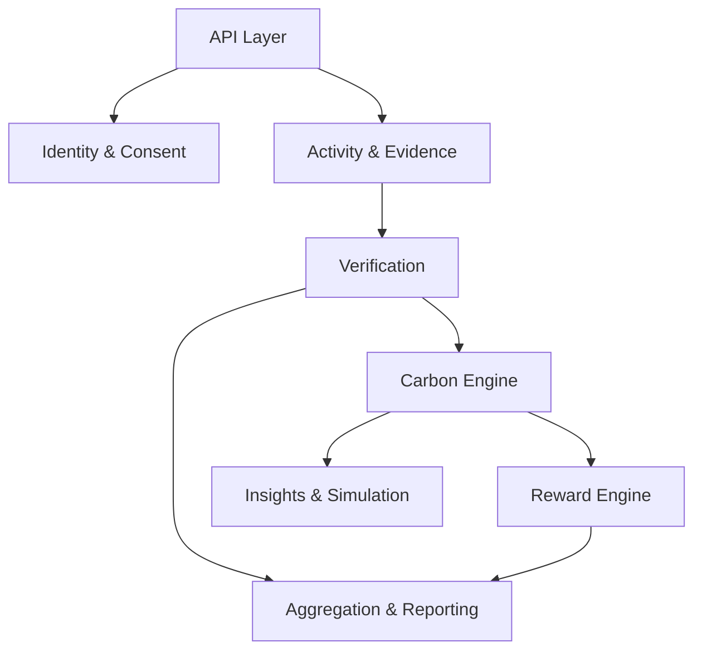

### Module responsibilities

| Module | Responsibilities | Must not do |
| --- | --- | --- |
| Identity and consent | Users, memberships, roles, consent events | Calculate emissions |
| Activity capture | Manual entry, recurring templates, QR and document intake | Mark its own evidence verified |
| Evidence | Metadata, file references, hashes, provenance | Issue reward points |
| Verification | Validity rules, duplicates, review state, evidence tier | Alter historical evidence silently |
| Factor registry | Factor sources, units, geography, effective dates, versions | Accept untraceable factors |
| Carbon engine | Unit normalization, calculation, uncertainty, baseline comparison | Use LLM-generated arithmetic |
| Scenario engine | Non-persistent or labelled projected alternatives | Present projections as observed reductions |
| Recommendation engine | Rank interventions by impact, effort, cost, and fit | Make unsupported causal claims |
| Reward engine | Eligibility, caps, append-only issue/reversal events | Accept client-created rewards |
| Intervention evaluation | Cohorts, periods, observed changes, later causal analysis | Claim causality without sufficient design/data |
| Reporting | Privacy-safe aggregates, exports, methodology details | Expose small cohorts or raw personal data by default |
| Audit | Administrative, security, and methodology events | Store secrets or full evidence contents |

---

## 5. Core End-to-End Data Flow

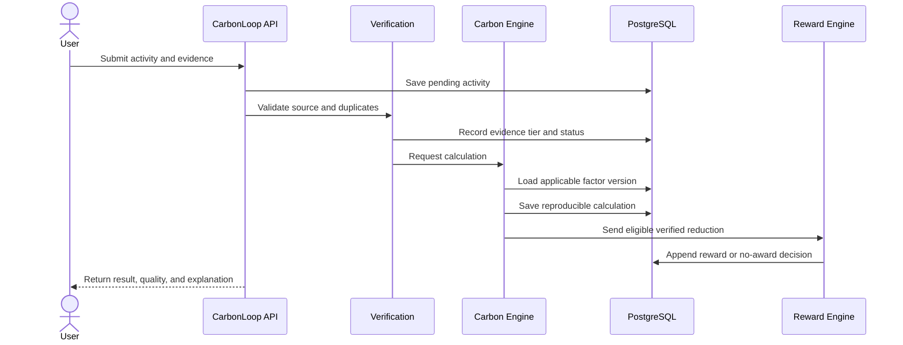

### Processing states

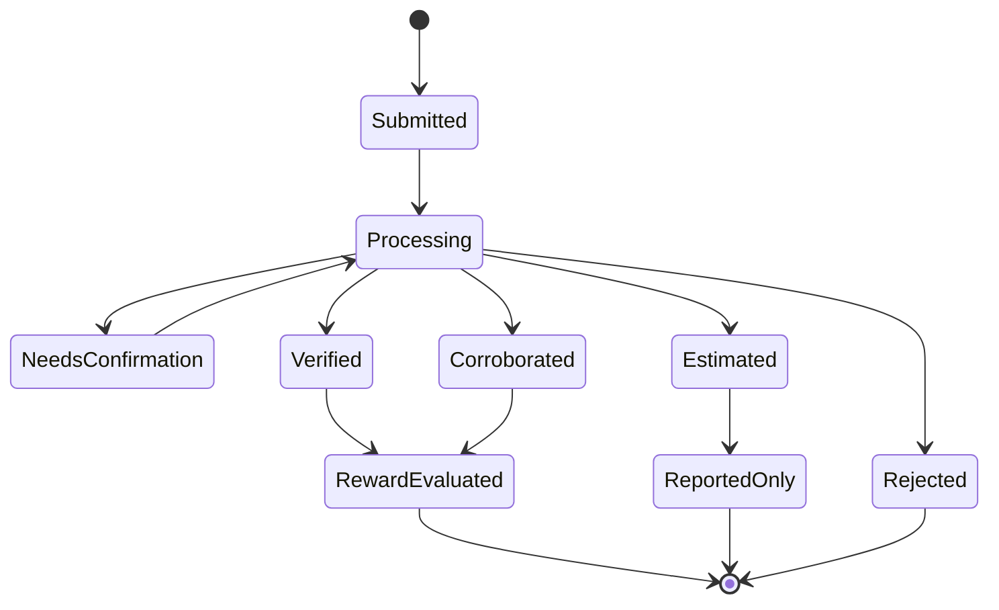

---

## 6. Critical User Flows

### 6.1 Shuttle QR verification

1. The shuttle or route displays a short-lived, rotating QR payload.
2. The student scans the QR in the authenticated PWA.
3. The server validates issuer, route, validity window, nonce, and replay status.
4. The server creates a V1 verified transport activity.
5. The carbon engine compares shuttle emissions with the eligible baseline mode.
6. The reward engine checks reduction, repetition caps, and challenge rules.
7. Personal results and privacy-safe campus aggregates update.

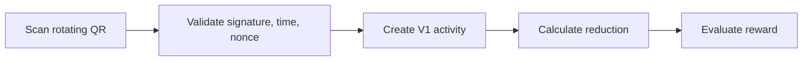

### 6.2 Electricity bill extraction

1. The user gives purpose-specific consent and uploads a bill.
2. The API stores it privately and creates an extraction job.
3. OCR extracts provider, billing dates, kWh, and account-region hints.
4. A multimodal model may propose structured fields when OCR confidence is low.
5. Zod validates the proposed structure; the user confirms or corrects it.
6. The factor registry selects the applicable versioned electricity factor.
7. The carbon engine calculates CO2e and records quality and uncertainty.
8. The original file follows the configured deletion or retention policy.

> AI-extracted values are proposals. They become calculation inputs only after validation and, where required, user confirmation.

### 6.3 What-if simulation

1. Load the user's baseline profile.
2. Apply two or more selected changes to a scenario copy.
3. Normalize quantities and select factor versions.
4. Calculate baseline and alternative totals.
5. Display projected reduction, uncertainty, effort, cost, and assumptions.
6. Label the result **Projected**, never **Verified**.

### 6.4 Institutional reporting

1. Aggregate eligible activity and calculation records by campus and period.
2. Separate verified, corroborated, and estimated totals.
3. Suppress cohorts below the configured privacy threshold.
4. Include methodology version, factor coverage, uncertainty, and data-quality score.
5. Expose results through the dashboard and export service.

---

## 7. Database Architecture

### Entity relationship overview

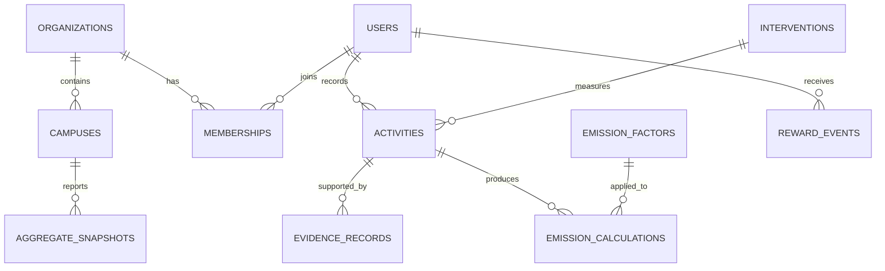

### Principal tables

| Table | Key fields | Purpose |
| --- | --- | --- |
| `organizations` | `id`, `name`, `settings` | University or tenant |
| `campuses` | `id`, `organization_id`, `region`, `timezone` | Campus-specific configuration |
| `users` | `id`, `auth_user_id`, `pseudonymous_key` | Minimal application profile |
| `memberships` | `user_id`, `organization_id`, `campus_id`, `role` | Tenant access and roles |
| `consent_events` | `user_id`, `purpose`, `action`, `policy_version`, `created_at` | Append-only consent history |
| `activities` | `user_id`, `category`, `quantity`, `unit`, `occurred_at`, `status` | Reported or captured action |
| `evidence_records` | `activity_id`, `source_type`, `storage_ref`, `hash`, `tier`, `status` | Evidence provenance and outcome |
| `emission_factors` | `category`, `value`, `unit`, `source`, `version`, `geography`, `valid_from`, `valid_to` | Versioned factor registry |
| `emission_calculations` | `activity_id`, `factor_id`, `engine_version`, `input_snapshot`, `co2e_kg`, `uncertainty` | Reproducible calculation |
| `baselines` | `user_id` or `cohort_id`, `period`, `method`, `value` | Comparison reference |
| `scenarios` | `user_id`, `input`, `result`, `factor_snapshot`, `label` | What-if projections |
| `interventions` | `campus_id`, `cohort`, `period`, `design`, `status` | Campus sustainability programs |
| `reward_events` | `user_id`, `points_delta`, `reason`, `evidence_tier`, `reversal_of` | Append-only reward ledger |
| `aggregate_snapshots` | `campus_id`, `period`, `metrics`, `privacy_threshold` | Privacy-safe dashboard data |
| `audit_events` | `actor_id`, `action`, `target_type`, `target_id`, `created_at` | Security and administration trail |
| `jobs` | `type`, `payload`, `status`, `attempts`, `available_at` | Background processing queue |

### Data invariants

- A calculation always references an immutable factor version or stores a complete factor snapshot.
- Accepted quantities use canonical units after conversion.
- Evidence status changes create audit events.
- Reward balances are derived from event sums; no editable balance is authoritative.
- Reward reversals reference the original event.
- Users cannot insert or edit verified evidence, calculations, or reward events directly.
- Every tenant-owned record carries `organization_id` or an unambiguous parent relationship.
- Deleted personal evidence is replaced by required non-identifying verification metadata when legally and methodologically permitted.

---

## 8. Carbon Calculation Architecture

### Calculation pipeline

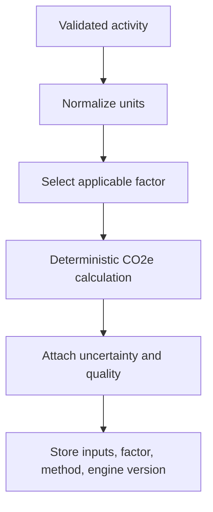

### Required calculation record

```text
activity category
quantity and canonical unit
emission factor value and unit
factor source, version, geography, and effective dates
calculation method
calculation-engine version
estimated kg CO2e
uncertainty or quality range
evidence tier
calculation timestamp
```

### Factor-selection priority

1. Institution- or supplier-specific measured data
2. India-specific activity factor
3. Regional or sector-specific secondary factor
4. Clearly labelled international fallback
5. Spend-based estimate only when reliable activity data is unavailable

The factor registry must never silently replace the factor used by a historical result. Updated factors create new versions; recalculation creates a new calculation record linked to the updated methodology.

---

## 9. Evidence and Trust Architecture

| Tier | Meaning | Example | Reward treatment |
| --- | --- | --- | --- |
| V1 — Verified | Trusted issuer or institutional record | Signed shuttle event, meter record | Full eligibility |
| V2 — Corroborated | Supporting evidence passed validation | Confirmed bill or receipt | Conditional eligibility |
| V3 — Estimated | Plausible self-report without strong evidence | Manual commute entry | Insights; limited/no redeemable points |
| V4 — Rejected | Invalid, duplicate, manipulated, or implausible | Reused QR or duplicate bill | Ineligible |

### Anti-fraud controls

- Rotating, signed QR payloads
- Short validity windows and nonce replay protection
- Idempotency keys for submissions and rewards
- Content hashes for duplicate evidence detection
- Rate limits per user, device, route, and endpoint
- Plausibility ranges for quantity, distance, time, and frequency
- Manual review queue for ambiguous high-value claims
- Append-only reversals instead of destructive record changes
- Audit trail for privileged decisions

### Optional future trust layer

W3C Verifiable Credentials may be added when a real campus department or partner becomes an independent issuer. A Merkle transparency log is justified only if external auditors require portable inclusion proofs. Neither is necessary for MVP correctness.

---

## 10. API Architecture

### MVP endpoints

```text
POST   /api/activities
GET    /api/activities
POST   /api/evidence/upload
POST   /api/evidence/shuttle-checkin
GET    /api/emissions/summary
POST   /api/scenarios/calculate
GET    /api/recommendations
GET    /api/rewards
POST   /api/consent
DELETE /api/consent/:purpose
GET    /api/campus/overview
POST   /api/campus/interventions
GET    /api/campus/reports/export
```

### Endpoint requirements

Every write endpoint must apply:

1. Authentication
2. Schema validation
3. Tenant and role authorization
4. Consent/purpose validation where personal data is involved
5. Rate limiting
6. Idempotency for repeatable submissions
7. Transactional database write
8. Audit event for sensitive operations

Use a stable error shape:

```json
{
  "error": {
    "code": "EVIDENCE_DUPLICATE",
    "message": "This evidence has already been submitted.",
    "requestId": "opaque-request-id"
  }
}
```

---

## 11. Authorization and Privacy Boundaries

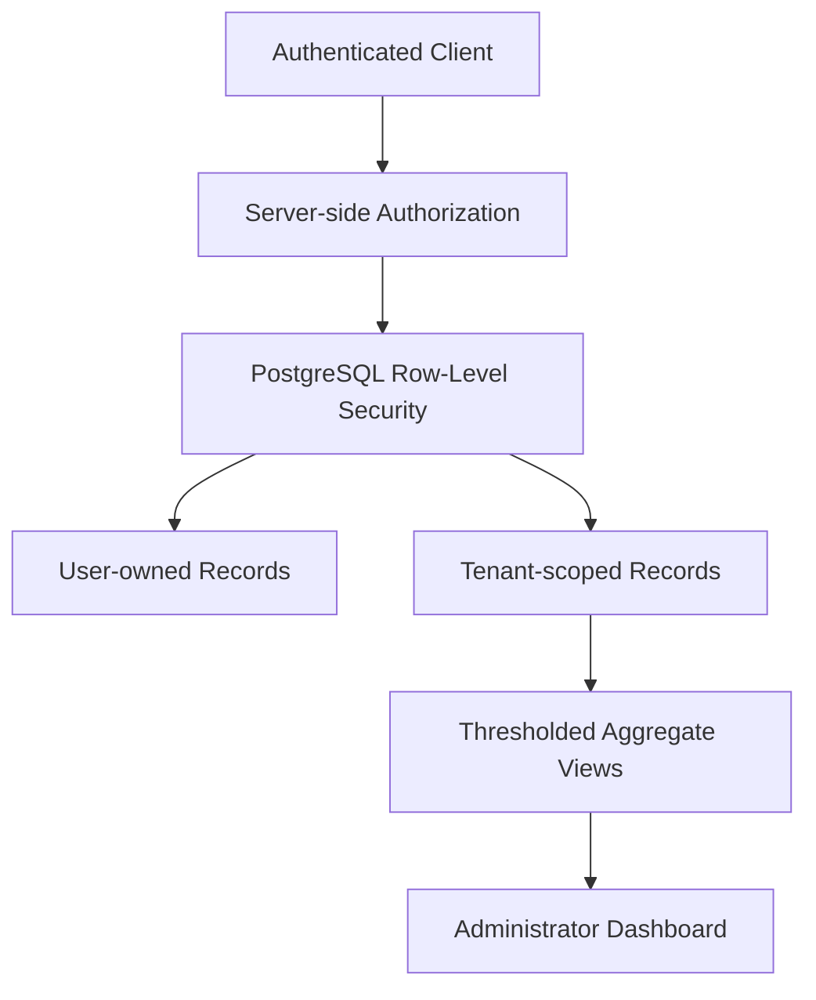

### Role permissions

| Capability | User | Campus admin | Platform methodologist | Service role |
| --- | :---: | :---: | :---: | :---: |
| View own activities | Yes | No by default | No | Audited only |
| Upload own evidence | Yes | No | No | No |
| View campus aggregates | No | Yes | Limited | Yes |
| Create intervention | No | Yes | Limited | Yes |
| Publish emission factor | No | No | Yes | Yes |
| Issue/reverse rewards | No | Rule request only | No | Yes |
| Review flagged evidence | No | Scoped role | No | Yes |

### Privacy controls

- Purpose-specific consent with a versioned policy reference
- Data minimization and separate identity/analytics identifiers
- Private evidence objects with short-lived signed access URLs
- Configurable evidence retention and deletion jobs
- Minimum cohort threshold before displaying group statistics
- Opt-in individual leaderboards only
- Aggregate institutional reporting by default
- No direct UPI ingestion in the MVP

---

## 12. Background Processing

The MVP uses a PostgreSQL-backed `jobs` table and a worker function. This avoids introducing Redis or a workflow platform before it is needed.

### Initial job types

- `extract_document`
- `scan_uploaded_file`
- `refresh_aggregate_snapshot`
- `generate_report`
- `expire_evidence`
- `recalculate_with_new_methodology` — explicit operation only

### Reliability rules

- Claim jobs with row locking so only one worker processes each job.
- Use bounded retries and exponential backoff.
- Store a terminal failure reason.
- Make handlers idempotent.
- Send repeatedly failing jobs to a review state.
- Trace a job from its originating request ID.

Temporal or another workflow engine should be added only when processes become long-running, multi-service, and difficult to recover with the database job model.

---

## 13. Deployment Architecture

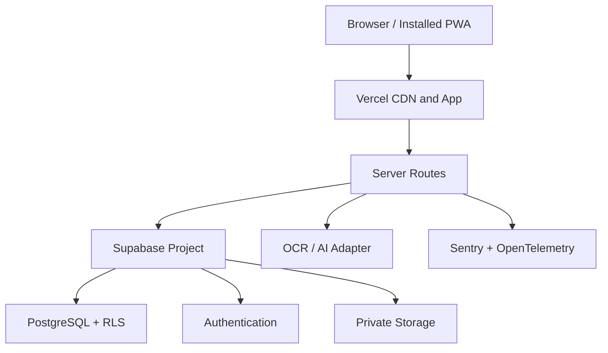

### Environments

| Environment | Purpose | Data policy |
| --- | --- | --- |
| Local | Developer implementation and tests | Synthetic data only |
| Preview | Pull-request and demo validation | Seeded or anonymized data |
| Staging | Integration, migration, security, and UAT | Separate tenant and keys |
| Production | Pilot and live campus use | Controlled personal data |

### CI/CD gates

1. Formatting and linting
2. Type checking
3. Unit and calculation fixture tests
4. Database migration validation
5. RLS and authorization tests
6. Integration tests
7. Playwright critical-journey tests
8. Dependency and secret scanning
9. Staging smoke test
10. Controlled production migration and release

---

## 14. Observability and Operations

### Monitor

- API latency and error rate
- Authentication and authorization failures
- Job queue age and terminal failures
- OCR confidence and user-correction rate
- Calculation failures by category and factor version
- QR replay and duplicate-evidence attempts
- Reward issuance and reversal anomalies
- Aggregate refresh delay
- Evidence deletion compliance

### Audit events

Record at least:

- Administrator access and configuration changes
- Factor publication and retirement
- Evidence approval, rejection, or tier change
- Reward issuance and reversal
- Consent grant and withdrawal
- Export generation
- Privileged support access

Never log raw bills, receipts, tokens, session secrets, or unnecessary personal fields.

---

## 15. Testing Architecture

### Highest-priority tests

| Test type | Examples |
| --- | --- |
| Calculation fixtures | Known quantity × factor results; unit conversion; rounding |
| Factor selection | Geography, category, validity dates, fallback order |
| Verification | QR expiry, nonce replay, duplicate hash, implausible values |
| Authorization | Cross-user and cross-campus access denied |
| RLS | Direct database access cannot bypass tenant boundaries |
| Rewards | Idempotent issuance, caps, reversal, no client insert |
| Privacy | Small cohorts suppressed; withdrawn purpose stops new processing |
| Extraction | Low confidence requires confirmation; malformed output rejected |
| End-to-end | Shuttle, bill, simulator, reward, aggregate dashboard |

Calculation fixtures must be reviewed whenever a factor or method changes. Historical results remain tied to the version that produced them.

---

## 16. Architecture by Project Phase

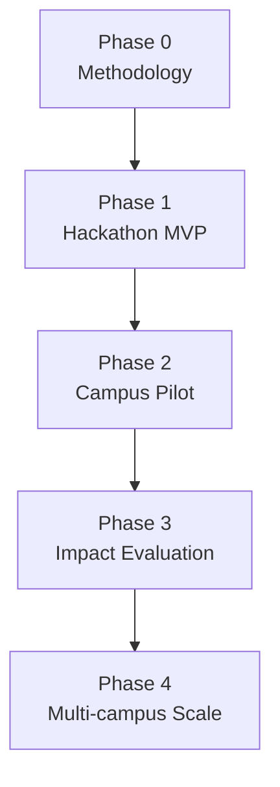

### [[Phase 0 - Methodology and Setup]]

- Finalize categories, factor sources, units, evidence tiers, consent purposes, and pilot success metrics.
- Create the data dictionary and calculation fixtures.
- Configure development, staging, and production boundaries.

### [[Phase 1 - Hackathon MVP]]

- Next.js PWA and Supabase foundation
- Authentication, roles, consent, and RLS
- Activities, evidence, factor registry, and calculation engine
- Shuttle QR vertical slice
- Bill extraction with confirmation
- What-if simulator
- Append-only rewards
- Personal dashboard and seeded institutional dashboard

### [[Phase 2 - Campus Pilot]]

- Real campus configuration and administrator workflow
- Evidence-review queue
- Aggregate snapshots and privacy thresholds
- Intervention creation and reporting
- Monitoring, retention jobs, backups, and incident process
- CSV/PDF-ready report exports

### [[Phase 3 - Impact Evaluation]]

- Baseline and matched-control data-quality review
- Python/FastAPI evaluation service only if justified
- DoWhy/EconML or reviewed statistical workflow
- Confidence intervals and methodology approval
- No causal label until design and sample quality pass review

### [[Phase 4 - Multi-campus Scale]]

- Automated tenant onboarding and institutional configuration
- Partner-issued verifiable credentials where real issuers exist
- Dedicated analytics store only if PostgreSQL is measurably insufficient
- Workflow platform only if long-running integrations require it
- Recommendation search infrastructure only after rules/catalogue reach their limit

---

## 17. Scaling Triggers

| Current design | Possible addition | Trigger—not a guess |
| --- | --- | --- |
| PostgreSQL reporting | ClickHouse | Repeated, measured analytical queries exceed agreed latency/cost targets after indexing and aggregation |
| PostgreSQL job table | Temporal | Long-running multi-step workflows fail or require complex compensation |
| Rules and metadata search | pgvector or Qdrant | Intervention catalogue becomes too large or semantic retrieval shows measurable benefit |
| TypeScript application | Python/FastAPI evaluation service | Real pilot data and reviewed causal methods require Python libraries |
| Signed institutional events | W3C Verifiable Credentials | Independent campus/partner issuers need portable claims |
| Internal audit events | Merkle transparency log | External auditors explicitly require independently verifiable inclusion proofs |
| Modular monolith | Extracted service | A module requires independent scaling, ownership, or failure isolation demonstrated by production measurements |

The following are deliberately excluded from the initial architecture: Neo4j, InfluxDB, Redis, Qdrant, blockchain, federated learning, direct UPI ingestion, and unsupported live marginal-grid calculations.

---

## 18. Failure Handling

| Failure | Expected behavior |
| --- | --- |
| OCR provider unavailable | Keep evidence pending; retry; allow manual entry |
| AI returns invalid structure | Reject through schema validation; request confirmation/manual correction |
| Applicable factor missing | Do not invent a value; show unsupported state and flag methodology review |
| Duplicate QR submission | Return idempotent existing result or reject replay without issuing another reward |
| Aggregate below privacy threshold | Suppress the cohort and combine where permitted |
| Reward rule fails after calculation | Preserve calculation; record no-award reason |
| Evidence later invalidated | Append verification change and reward reversal; retain audit history |
| Background job repeatedly fails | Move to review state and alert operator |
| External provider timeout | Use bounded timeout and retry; do not block the entire application |

---

## 19. Repository Structure

```text
carbonloop/
├── app/
│   ├── (student)/
│   ├── admin/
│   └── api/
├── modules/
│   ├── identity/
│   ├── consent/
│   ├── activities/
│   ├── evidence/
│   ├── verification/
│   ├── factors/
│   ├── carbon-engine/
│   ├── scenarios/
│   ├── recommendations/
│   ├── rewards/
│   ├── interventions/
│   └── reporting/
├── adapters/
│   ├── database/
│   ├── storage/
│   ├── extraction/
│   └── observability/
├── components/
├── jobs/
├── supabase/
│   ├── migrations/
│   ├── policies/
│   └── seed.sql
├── tests/
│   ├── fixtures/
│   ├── integration/
│   └── e2e/
└── docs/
```

Module code should expose public interfaces through each module's entry point. Direct imports into another module's internal files should be prohibited through linting or repository conventions.

---

## 20. Hackathon Reference Architecture

For the hackathon, implement one complete vertical slice:

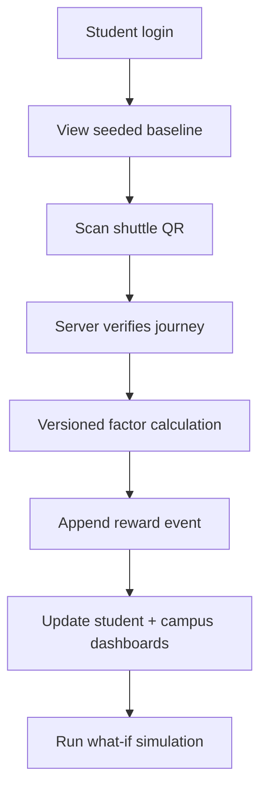

### Demo data labels

- Real interaction: clearly labelled live demo event
- Seeded history: clearly labelled sample data
- Scenario result: clearly labelled projection
- Causal result: clearly labelled simulation unless based on an approved real evaluation
- Estimated emissions: never presented as independently verified reduction

---

## 21. Definition of Architecture Success

The architecture succeeds when:

- A developer can trace every displayed CO2e value to an activity, factor version, and method.
- A user cannot issue their own verified claim or reward.
- An administrator cannot accidentally view another campus's data.
- The dashboard distinguishes verified, corroborated, and estimated results.
- Small groups are suppressed automatically.
- A repeated request cannot create duplicate activity or reward events.
- OCR/AI failure does not stop manual or QR-based workflows.
- The three-person team can deploy, monitor, and explain the complete system.
- New infrastructure is introduced only in response to a documented scaling trigger.

---

## 22. Final Architecture Summary

> **CarbonLoop uses a modular Next.js and TypeScript application, Supabase PostgreSQL as its authoritative system of record, deterministic versioned carbon calculations, evidence-tiered server-side verification, append-only rewards, and privacy-safe institutional aggregation.**

This architecture supports the project's USP without overengineering: it proves the chain from a real campus activity to evidence quality, carbon calculation, reward decision, and institutional insight.

## Related Notes

- [[Project Roadmap]]
- [[Project Overview]]
- [[Phase 2 - System Design]]
- [[Phase 3 - Development]]