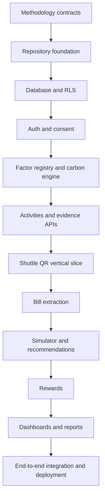

# CarbonLoop — Codex Build Playbook

Use this playbook to build CarbonLoop in small, testable stages. Do not ask Codex to build the complete product in one prompt.

## 1. Files Codex must always have

Copy these files from Obsidian into the code repository:

```text
carbonloop/
└── docs/
    ├── CarbonLoop_Final_Project.md
    ├── CarbonLoop_Architecture.md
    ├── CarbonLoop_Phase_Roadmap.md
    ├── Phase_0_Methodology_and_Setup.md
    └── Phase_1_Hackathon_MVP.md
```

Add the later phase note only when that phase begins. Obsidian remains the planning vault; the repository's `docs/` directory is what Codex reads while coding.

## 2. Rules for every Codex task

Paste this at the beginning of a new Codex conversation:

```text
You are building CarbonLoop, an evidence-backed campus decarbonization platform.

Before making changes, read completely:
- docs/CarbonLoop_Final_Project.md
- docs/CarbonLoop_Architecture.md
- docs/CarbonLoop_Phase_Roadmap.md
- the current phase note in docs/

Treat those files as binding requirements and the source of truth.

Architecture constraints:
- Use a modular monolith.
- Use Next.js PWA + TypeScript, Supabase PostgreSQL/Auth/Storage/RLS, Zod, Tailwind CSS and shadcn/ui.
- Keep PostgreSQL as the authoritative system of record.
- Perform calculations, verification and reward issuance on the server.
- Official CO2e calculations must be deterministic and versioned; do not use an LLM for them.
- OCR/model output must be schema-validated and confirmed when confidence is low.
- Do not introduce Neo4j, InfluxDB, Redis, Qdrant, blockchain, federated learning or direct UPI ingestion for the MVP.
- Do not invent emission factors, APIs, statistics, credentials or research sources. Mark missing information as NEEDS_VERIFICATION.

Working rules:
1. Inspect the existing repository and preserve correct work.
2. State which requirement and checklist item you are implementing.
3. Propose a short plan before editing.
4. Implement only the requested bounded stage.
5. Add or update tests for all business and security rules.
6. Run relevant lint, type-check and tests.
7. Report changed files, tests run, assumptions, remaining risks and the next recommended task.
8. Do not mark an Obsidian task complete unless its acceptance criteria and tests pass.
```

## 3. Build order



## Prompt 0 — Audit before building

```text
Read all required CarbonLoop documents in docs/ and inspect the repository. Do not change code yet.

Return:
1. The current implementation state.
2. Missing prerequisites for the current phase.
3. Conflicts between the code and approved architecture.
4. Security, privacy and methodology risks.
5. A dependency-ordered implementation plan with acceptance criteria.
6. The single smallest task that should be implemented next.

Do not guess missing facts. Label them NEEDS_VERIFICATION.
```

## Prompt 1 — Methodology contracts

Use this before application development.

```text
Implement only the Phase 0 methodology contracts and fixtures. Do not build UI or production APIs yet.

Create version-controlled definitions for:
- supported MVP categories and canonical units;
- emission-factor schema with source, version, geography, effective dates and quality;
- V1, V2, V3 and V4 evidence tiers;
- calculation input/output schemas;
- consent purposes and retention fields;
- reward eligibility concepts;
- known-input calculation fixtures.

Use TypeScript and Zod for machine-readable contracts. Use clearly labelled placeholder fixtures only where an approved factor is missing. Never fabricate a real factor.

Add tests proving invalid units, missing provenance and invalid evidence tiers are rejected. Run tests and report whether the Phase 0 completion criteria pass.
```

## Prompt 2 — Repository foundation

```text
Scaffold the CarbonLoop MVP repository using the approved modular-monolith architecture.

Set up:
- Next.js with TypeScript;
- Tailwind CSS and shadcn/ui foundation;
- Zod validation;
- Vitest and Playwright;
- ESLint, formatting and type-check scripts;
- environment-variable validation;
- module folders for identity, consent, activities, evidence, verification, factors, carbon-engine, scenarios, recommendations, rewards, interventions and reporting;
- adapter folders for database, storage, extraction and observability.

Do not implement business features yet. Add a health page/test and document local setup. Run lint, type-check and tests.
```

## Prompt 3 — Supabase schema and RLS

```text
Implement the first Supabase migrations and Row-Level Security policies for CarbonLoop.

Include organizations, campuses, users, memberships, consent_events, activities, evidence_records, emission_factors, emission_calculations, baselines, scenarios, interventions, reward_events, aggregate_snapshots, audit_events and jobs.

Requirements:
- every tenant-owned record must carry organization_id/campus_id or an unambiguous parent;
- calculations reference an immutable factor or complete snapshot;
- reward balance is derived from append-only events;
- users cannot directly create verified evidence, calculations or rewards;
- campus administrators cannot access another tenant;
- administrators see aggregates by default;
- migrations must be repeatable and reversible where safe.

Add database/RLS tests for same-user access, cross-user denial, same-campus admin rules and cross-campus denial. Do not implement endpoints yet.
```

## Prompt 4 — Authentication and consent

```text
Implement CarbonLoop authentication, membership roles and purpose-specific consent.

Build:
- Supabase sign-up, sign-in and sign-out;
- authenticated server session handling;
- user and campus-admin authorization guards;
- onboarding and campus membership selection;
- append-only consent grant/withdrawal events;
- UI for viewing and changing consent;
- tests for unauthenticated, wrong-role and withdrawn-consent behavior.

Do not build emissions or rewards yet. Keep service credentials server-only.
```

## Prompt 5 — Factor registry and deterministic engine

```text
Implement the versioned emission-factor registry and deterministic TypeScript CO2e calculation engine.

Pipeline:
validated activity -> canonical unit conversion -> applicable factor selection -> deterministic calculation -> uncertainty/quality attachment -> immutable calculation record.

Requirements:
- select by category, geography and effective date;
- follow the documented factor-priority order;
- never silently substitute a factor;
- return an unsupported state when no approved factor exists;
- store quantity, unit, factor source/version, method, engine version, evidence tier and timestamp;
- historical results remain tied to the original factor version.

Add fixture tests for known calculations, unit conversion, date boundaries, geography, fallbacks, rounding, missing factors and invalid inputs. Do not use AI in the calculation path.
```

## Prompt 6 — Activities and evidence endpoints

```text
Implement the authenticated activity and evidence API foundation.

Endpoints:
- POST /api/activities
- GET /api/activities
- POST /api/evidence/upload

For every write request apply authentication, Zod validation, tenant authorization, consent validation, rate limiting, idempotency where applicable, a transactional write and an audit event.

Evidence uploads must use private storage, validate size/type, calculate a content hash and detect duplicates. New manual activity claims default to V3 unless a trusted verification flow upgrades them.

Use a stable error shape with code, message and requestId. Add integration tests for success, invalid input, missing consent, duplicate submission, cross-user access and unsupported factors.
```

## Prompt 7 — Shuttle QR vertical slice

```text
Build the complete verified campus-shuttle journey as CarbonLoop's first vertical slice.

Implement:
- rotating signed QR payloads;
- route, validity-window, signature and nonce validation;
- replay protection and idempotency;
- POST /api/evidence/shuttle-checkin;
- server-created V1 evidence and transport activity;
- deterministic factor calculation;
- eligible baseline comparison;
- idempotent append-only reward event;
- personal and aggregate dashboard refresh.

The user must not be able to submit V1 status or reward points directly. Test expired QR, invalid signature, reused nonce, duplicate request, wrong campus, missing factor and successful end-to-end flow. Add a Playwright journey for login -> scan -> result -> dashboard.
```

## Prompt 8 — Electricity-bill extraction

```text
Implement the electricity-bill evidence flow through the existing extraction adapter.

Flow:
private upload -> file validation -> OCR/model extraction -> Zod validation -> confidence check -> user confirmation/correction -> applicable versioned electricity factor -> deterministic calculation -> retention handling.

Extract only provider, billing period, consumption quantity, unit and confidence/provenance fields. AI output is untrusted and must never write an official calculation directly. Low-confidence or invalid output must require correction. Provider failure must leave evidence pending and allow manual entry.

Add tests for valid extraction, malformed AI output, low confidence, missing factor, duplicate bill and provider outage.
```

## Prompt 9 — Simulator and recommendations

```text
Implement the multi-variable what-if simulator and explainable recommendation catalogue.

Add:
- POST /api/scenarios/calculate;
- GET /api/recommendations;
- selection of two or three feasible changes;
- deterministic baseline and alternative calculations;
- reduction, effort, cost, uncertainty and possible reward display;
- rules-based ranking with an explanation for every recommendation;
- immutable factor snapshot for saved scenarios.

Every scenario must be visibly labelled as a projection, never a verified reduction. Do not add vector search or generic AI recommendations. Test calculation consistency and labels.
```

## Prompt 10 — Reward ledger

```text
Implement Green Reward Points using an append-only server-controlled reward ledger.

Requirements:
- only trusted server rules issue or reverse points;
- rewards prefer eligible V1 and V2 sustained reductions;
- apply repetition caps and idempotency;
- prevent one action from hiding a large increase elsewhere;
- record reason, evidence tier, issuer and optional reversal reference;
- calculate displayed balance from event sums;
- never call points carbon credits.

Implement GET /api/rewards and internal award/reversal services. Test duplicate issuance, caps, rejected evidence, reversal and attempts at direct client insertion.
```

## Prompt 11 — Dashboards, interventions and reports

```text
Implement the personal dashboard, privacy-safe institutional dashboard and initial intervention/reporting endpoints.

Endpoints:
- GET /api/emissions/summary
- GET /api/campus/overview
- POST /api/campus/interventions
- GET /api/campus/reports/export

Personal views: footprint trend, category contribution, evidence-quality share, baseline comparison, active actions, scenarios and reward history.

Institutional views: aggregate trend, participation, evidence coverage, category breakdown and intervention observations. Enforce the configurable minimum cohort size in the database/API, dashboard and exports. Administrators must not receive hidden raw personal records.

Clearly distinguish live, seeded, projected, observed and causal results. Add tests for threshold suppression, tenant isolation, report provenance and role authorization.
```

## Prompt 12 — Connect frontend to endpoints

```text
Connect the existing CarbonLoop frontend journeys to the implemented server endpoints. Do not duplicate business logic in the browser.

For every screen:
- define its typed request/response contract;
- call the server through a small API client;
- handle loading, empty, validation, unauthorized, unsupported-factor and provider-failure states;
- prevent duplicate submissions;
- show provenance and evidence-quality labels;
- add accessible user feedback;
- add integration and Playwright tests.

Create an endpoint coverage table showing route, consuming screen, authentication, role, validation, idempotency, tests and completion status. Remove mock data only after its live replacement passes tests.
```

## Prompt 13 — MVP integration, security and deployment

```text
Prepare the CarbonLoop Hackathon MVP for a controlled deployment.

Audit and complete:
- formatting, linting and type checking;
- unit, calculation, RLS, integration and Playwright tests;
- dependency and secret scanning;
- upload security and private storage;
- server-only credentials;
- rate limiting and replay protection;
- idempotent activities and rewards;
- seeded/live/projected labels;
- Sentry/OpenTelemetry setup without sensitive-data logging;
- Vercel and Supabase environment configuration;
- migrations, seed data, backup and rollback instructions;
- a demo runbook for the shuttle journey and simulator.

Do not hide failing tests. Return a release checklist with PASS, FAIL or BLOCKED evidence for every item.
```

## Prompt 14 — Campus pilot

```text
Read docs/Phase_2_Campus_Pilot.md and audit the MVP against its completion gate. Implement only the next approved pilot-readiness task.

Pilot work must include real campus configuration, scoped administrators, evidence review, privacy-safe aggregate snapshots, retention jobs, reports, monitoring, backup/restore and incident procedures. Preserve separation between observed change and causal impact.

For this turn, select one bounded task, implement it with tests, and report evidence against the phase checklist. Do not start causal analysis.
```

## Prompt 15 — Impact evaluation

```text
Read docs/Phase_3_Impact_Evaluation.md. Before writing analysis code, audit pilot data quality, evidence coverage, missingness, baseline length, comparison-group suitability and privacy constraints.

Do not make causal claims unless the design and sample quality pass the documented methodology review. If they do not pass, produce descriptive observed-change reporting only.

When justified, create a reproducible, de-identified evaluation boundary with versioned data, methods, uncertainty and sensitivity checks. Add Python/FastAPI and causal libraries only when the approved method requires them.
```

## Prompt 16 — Multi-campus scale

```text
Read docs/Phase_4_Multi-campus_Scale.md and inspect measured production bottlenecks and operational evidence. Implement only the next approved scaling task.

Prioritize repeatable tenant onboarding, configuration, RLS automation, governance, support and cost measurement. Do not add ClickHouse, Temporal, Qdrant/pgvector, verifiable credentials, a transparency log or extracted microservices unless the exact documented trigger is supported by measurements.

Report the trigger evidence before proposing any new infrastructure.
```

## 4. Endpoint connection map

| Feature | Endpoint | Build stage |
| --- | --- | --- |
| Manual activities | `POST /api/activities` | Prompt 6 |
| Activity history | `GET /api/activities` | Prompt 6 |
| Evidence upload | `POST /api/evidence/upload` | Prompt 6 |
| Shuttle verification | `POST /api/evidence/shuttle-checkin` | Prompt 7 |
| Emissions summary | `GET /api/emissions/summary` | Prompt 11 |
| Scenario calculation | `POST /api/scenarios/calculate` | Prompt 9 |
| Recommendations | `GET /api/recommendations` | Prompt 9 |
| Reward history | `GET /api/rewards` | Prompt 10 |
| Consent grant | `POST /api/consent` | Prompt 4 |
| Consent withdrawal | `DELETE /api/consent/:purpose` | Prompt 4 |
| Campus dashboard | `GET /api/campus/overview` | Prompt 11 |
| Interventions | `POST /api/campus/interventions` | Prompt 11 |
| Report export | `GET /api/campus/reports/export` | Prompt 11 |

## 5. How to track each Codex turn

After Codex completes a task:

1. Review the changed files and diff.
2. Confirm the required tests actually passed.
3. Manually run the affected user journey.
4. Record assumptions and blockers in Obsidian.
5. Tick the phase checkbox only after acceptance criteria pass.
6. Commit the working checkpoint to Git.
7. Give Codex the next prompt; do not skip forward.

Use this completion record in the current phase note:

```markdown
### Implementation record — YYYY-MM-DD

**Task:**

**Codex prompt used:** Prompt N

**Changed files:**

**Tests passed:**

**Manual verification:**

**Assumptions or blockers:**

**Git commit:**

**Next task:**
```

## 6. What to do first

1. Create the repository and its `docs/` folder.
2. Copy the approved Markdown documents into `docs/`.
3. Open the repository in Codex.
4. Paste the global rules.
5. Run **Prompt 0 — Audit before building**.
6. Resolve every `NEEDS_VERIFICATION` item.
7. Run **Prompt 1 — Methodology contracts**.
8. Continue in numerical order only after tests and acceptance criteria pass.

