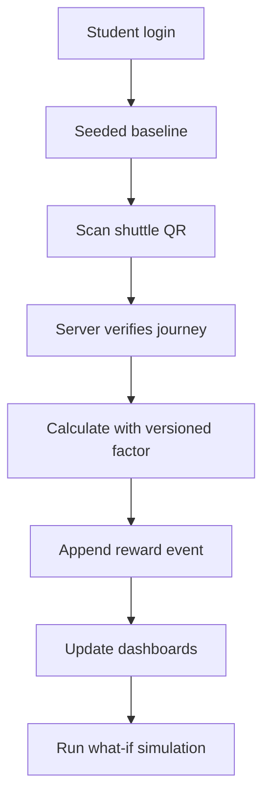

# Phase 1 — Hackathon MVP

## Purpose

Build a convincing end-to-end demonstration of CarbonLoop's core USP. The priority is one complete, trustworthy vertical slice—not many disconnected screens.

## Dependencies

- [[Phase 0 - Methodology and Setup]]
- [[CarbonLoop_Final_Project]]
- [[CarbonLoop_Architecture]]

## Demo story

## Architecture

- One Next.js PWA deployable
- Internal modules with clear boundaries
- Supabase PostgreSQL as the system of record
- Supabase Auth and private Storage
- PostgreSQL Row-Level Security
- Server-side calculations, verification, and reward issuance
- Database-backed jobs only when asynchronous work is necessary
- OCR/model adapter with manual correction fallback

## Build tasks

### 1. Identity, consent, and authorization

- [ ] Implement sign-up and sign-in.
- [ ] Create user, organization, campus, and membership records.
- [ ] Implement user and campus-admin roles.
- [ ] Record versioned consent events.
- [ ] Add RLS policies and cross-tenant denial tests.

### 2. Core database

- [ ] Create `organizations`, `campuses`, `users`, and `memberships`.
- [ ] Create `consent_events` and `activities`.
- [ ] Create `evidence_records` and `emission_factors`.
- [ ] Create `emission_calculations` and `baselines`.
- [ ] Create `scenarios`, `reward_events`, and `audit_events`.
- [ ] Add indexes, constraints, timestamps, and tenant ownership.

### 3. Deterministic carbon engine

- [ ] Normalize activity quantities into canonical units.
- [ ] Select the applicable factor by category, geography, and date.
- [ ] Calculate CO2e deterministically.
- [ ] Store the factor snapshot, engine version, evidence tier, and uncertainty.
- [ ] Add fixture tests for calculations, conversions, and fallbacks.

### 4. Shuttle QR vertical slice

- [ ] Generate rotating, signed QR payloads.
- [ ] Validate route, time window, signature, and nonce.
- [ ] Prevent replay and duplicate submissions.
- [ ] Create a V1 transport activity on the server.
- [ ] Calculate the activity's CO2e with a versioned factor.
- [ ] Evaluate the eligible reduction against the baseline.
- [ ] Append an idempotent reward event.

### 5. Electricity bill capture

- [ ] Upload a bill into private storage.
- [ ] Validate file type and size.
- [ ] Extract provider, period, kWh, and confidence.
- [ ] Require the user to confirm or correct the extracted values.
- [ ] Apply the correct electricity factor.
- [ ] Retain or delete the original according to the evidence policy.

### 6. What-if simulator

- [ ] Let the user change two or three activity variables.
- [ ] Calculate baseline and alternative scenarios.
- [ ] Display projected reduction, effort, cost, uncertainty, and possible reward.
- [ ] Label all results as projections.

### 7. Rewards

- [ ] Use append-only `reward_events`.
- [ ] Issue rewards only from trusted server code.
- [ ] Prefer V1 and eligible V2 activities.
- [ ] Add caps and idempotency rules.
- [ ] Support reversal events without editing history.
- [ ] Call them Green Reward Points, not carbon credits.

### 8. Dashboards

Personal dashboard:

- [ ] Current footprint and trend
- [ ] Category breakdown
- [ ] Verified versus estimated share
- [ ] Baseline comparison
- [ ] Scenario simulator
- [ ] Reward history

Seeded institutional dashboard:

- [ ] Aggregate emissions trend
- [ ] Participation and evidence-quality coverage
- [ ] Category breakdown
- [ ] Small-cohort suppression
- [ ] Clear labels for seeded/demo data

### 9. Testing and deployment

- [ ] Unit-test factor selection and calculation fixtures.
- [ ] Test QR expiry, replay, and duplicate hashes.
- [ ] Test cross-user and cross-campus access denial.
- [ ] Test reward idempotency and reversal.
- [ ] Add a Playwright test for the full shuttle journey.
- [ ] Deploy the app to Vercel and connect Supabase.
- [ ] Configure basic error monitoring.

## Suggested three-member ownership

| Member | Primary responsibility |
| --- | --- |
| Member 1 | PWA interface, personal dashboard, simulator |
| Member 2 | Supabase schema, Auth, RLS, APIs |
| Member 3 | Carbon engine, verification, rewards, institutional dashboard |

All members jointly own integration, testing, and the demo presentation.

## Deliverables

- Deployable Next.js PWA
- Authentication, consent, roles, and RLS
- Versioned factor registry and deterministic engine
- Working shuttle QR journey
- Bill-upload extraction with confirmation
- What-if simulator
- Append-only Green Reward Points
- Personal dashboard
- Seeded, privacy-safe institutional dashboard
- Automated critical-path tests

## Completion gate

- [ ] The team can demonstrate login → QR → verification → calculation → reward → dashboard.
- [ ] Every displayed CO2e result exposes its factor and methodology.
- [ ] Repeating the QR request cannot duplicate activity or reward records.
- [ ] Users cannot directly insert verified evidence or rewards.
- [ ] Seeded history and projected results are clearly labelled.
- [ ] The application remains usable when OCR fails.

## Next phase

After a stable demonstration and methodology review, continue to [[Phase 2 - Campus Pilot]].

