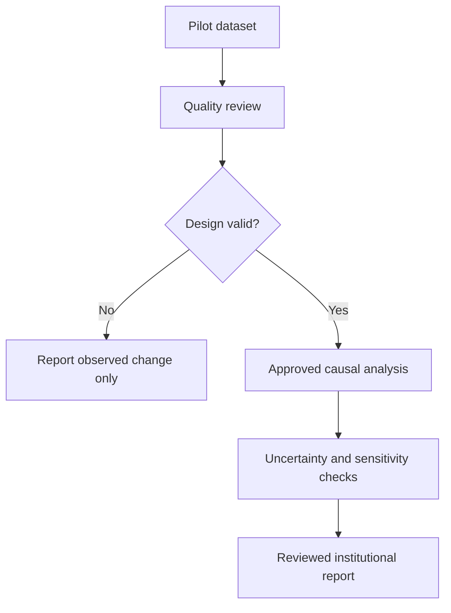

# Phase 3 — Impact Evaluation

## Purpose

Determine whether campus interventions actually caused measurable reductions. This phase changes CarbonLoop from an activity-reporting platform into institutional decision support, but causal language is permitted only after design and data quality pass review.

## Dependencies

- [[Phase 2 - Campus Pilot]]
- [[Phase 0 - Methodology and Setup]]
- [[CarbonLoop_Final_Project]]
- [[CarbonLoop_Architecture]]

## Evaluation principles

- Observed change is not automatically causal impact.
- The evaluation question and analysis plan must be defined before examining outcomes.
- Verified/corroborated and estimated data must remain distinguishable.
- Results must include uncertainty and limitations.
- Seeded or synthetic results must always be labelled simulation.

## Work packages

### 1. Data-quality review

- [ ] Measure missingness by activity, cohort, and period.
- [ ] Review V1/V2/V3 evidence coverage.
- [ ] Inspect factor versions and methodology changes.
- [ ] Review outliers, duplicate attempts, and corrections.
- [ ] Confirm baseline length and seasonality coverage.
- [ ] Check whether cohort sizes meet privacy and statistical requirements.

### 2. Define the evaluation

- [ ] State the intervention and expected mechanism.
- [ ] Define the primary outcome.
- [ ] Define the treatment and comparison groups.
- [ ] Define pre- and post-intervention periods.
- [ ] Identify confounders and concurrent campus changes.
- [ ] Predefine exclusion and sensitivity-analysis rules.
- [ ] Obtain methodology approval.

### 3. Select a defensible method

Choose only after reviewing the available data:

- Matched cohort comparison
- Difference-in-differences
- Interrupted time series
- Reviewed experimental or quasi-experimental design

Do not use a complex method merely because the library is available.

### 4. Create an analysis boundary

- [ ] Export a de-identified, purpose-limited analysis dataset.
- [ ] Preserve factor and calculation-engine versions.
- [ ] Document every transformation.
- [ ] Keep production application writes separate from analysis.
- [ ] Add Python + FastAPI only if approved methods require Python libraries.
- [ ] Use DoWhy/EconML only when the design and data justify them.

### 5. Run and validate analysis

- [ ] Estimate the intervention effect.
- [ ] Calculate confidence intervals or credible uncertainty ranges.
- [ ] Run balance and pre-trend checks where applicable.
- [ ] Perform sensitivity analyses.
- [ ] Compare verified-only results with broader evidence tiers.
- [ ] Obtain independent internal or academic review.

### 6. Present results responsibly

- [ ] Report sample size and evidence coverage.
- [ ] State factor versions and calculation methods.
- [ ] Separate observed change, modeled effect, and projection.
- [ ] Report uncertainty and major limitations.
- [ ] Avoid individual or small-cohort disclosure.
- [ ] Do not label Green Reward Points as carbon credits.

## Evaluation flow

## Deliverables

- Pilot data-quality assessment
- Approved evaluation protocol
- De-identified analysis dataset
- Reproducible analysis code and environment
- Effect estimates with uncertainty
- Sensitivity and limitation report
- Institutional impact-evaluation report
- Recommendation on which interventions to continue, modify, or stop

## Completion gate

- [ ] The result is reproducible from a versioned dataset and analysis plan.
- [ ] Every outcome is traceable to its factor and engine versions.
- [ ] Claims accurately distinguish association, observed change, and causation.
- [ ] Uncertainty and limitations are visible in the dashboard/report.
- [ ] Privacy thresholds remain enforced.
- [ ] Institutional decision-makers can compare intervention effectiveness.

## Risks

- **Insufficient sample:** extend the pilot or report descriptive results only.
- **Poor comparison group:** avoid causal claims and redesign the next pilot.
- **Method changes:** stratify or recalculate explicitly; never silently mix versions.
- **Overclaiming:** require methodology approval before publishing causal language.

## Next phase

Move to [[Phase 4 - Multi-campus Scale]] only when the product, operations, and evidence demonstrate repeatable value.

