# CarbonLoop — Gamified Platform Architecture

> **Purpose:** Technical architecture for an Android-first, real-world sustainability game that verifies daily activities, calculates defensible avoided emissions, awards two separate point types, supports reward redemption, and produces privacy-safe institutional insights.

**Architecture style:** Mobile-first modular monolith  
**Mobile client:** Android — Kotlin and Jetpack Compose  
**Institution dashboard:** Next.js and TypeScript  
**System of record:** Supabase PostgreSQL  
**Initial deployment:** Vercel + Supabase + Android application  
**Product specification:** [[CarbonLoop_Game_Overview]]

**Architecture-pivot decision:** [ADR-0002: Android-First Game Architecture Pivot](decisions/ADR-0002-android-first-game-architecture-pivot.md) — proposed.

---

## 1. Architecture Objectives

The system must:

1. Track only the signals required for an active purpose or mission.
2. Separate physical activity from verified carbon reduction.
3. Make every displayed CO2e value reproducible.
4. Prevent clients from issuing verified evidence, rewards, or redemptions.
5. Support game progression without allowing sensor farming to create environmental claims.
6. Protect health, mobility, evidence, and identity information.
7. Give institutions aggregate insights without exposing individuals by default.
8. Remain feasible for a three-person team.
9. Add services or databases only after a measured bottleneck exists.

---

## 2. Architecture Decision

CarbonLoop begins as a **modular monolith with two first-party clients**:

- An Android application for player missions, activity permissions, sensor integration, game progress, and rewards.
- A Next.js web application for institutional dashboards, campaign management, reporting, and operator tools.

Both clients call one authenticated application API. The server contains independently testable domain modules. PostgreSQL is the authoritative source for players, missions, activities, evidence, calculations, points, rewards, consent, and aggregates.

### Why not PWA-only?

A PWA is appropriate for the administrator dashboard and limited manual participation, but it is not the reliable foundation for continuous background activity detection, health-record integration, or native permission workflows. The player experience is therefore Android-first.

### Why not microservices?

- A three-person team needs one deployment and one transaction boundary.
- Verification, calculation, and reward issuance must remain consistent.
- Splitting services early introduces queues, retries, distributed tracing, and data synchronization without proven need.
- Clear module interfaces preserve a future extraction path.

---

## 3. System Context

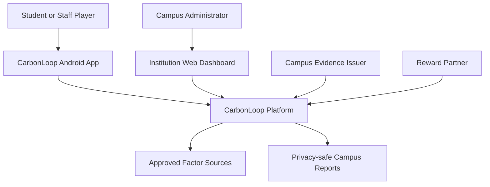

### External systems

| System | Use | Trust boundary |
| --- | --- | --- |
| Android Health Connect | Steps, exercise sessions, permitted route/workout information | User permission; source provenance retained |
| Activity Recognition API | Low-power movement-state suggestions | Confidence signal, not proof of trip purpose |
| Device location | Active route challenge only | Explicit permission and visible tracking state |
| Campus QR/NFC issuer | Shuttle, station, event, or facility evidence | Issuer key and replay protection |
| OCR/AI extraction provider | Proposed bill/receipt fields | Output is untrusted until schema validation/confirmation |
| Reward partner | Catalogue and fulfilment | Minimum data; idempotent fulfilment |
| Factor publisher | Emission-factor source material | Reviewed before registry publication |

---

## 4. High-Level Architecture

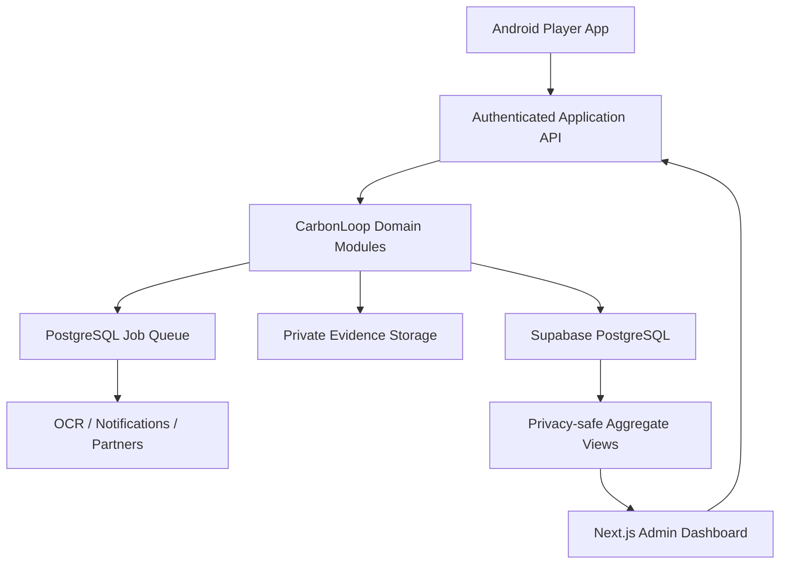

### Technology stack

| Layer | Technology | Responsibility |
| --- | --- | --- |
| Android app | Kotlin + Jetpack Compose | Player UI, permissions, challenges, offline queue |
| Android activity data | Health Connect | Permissioned steps and exercise records |
| Motion state | Activity Recognition API | Low-power activity suggestions |
| Challenge route | Fused location/GPS | Route evidence only during active mission |
| Admin web | Next.js + TypeScript | Campaigns, dashboards, evidence review, reports |
| API | Next.js server routes or modular TypeScript service | Authentication, orchestration, business rules |
| Validation | Zod | API, extraction, event, and calculation schemas |
| Database | Supabase PostgreSQL | Authoritative transactional and aggregate records |
| Authentication | Supabase Auth | Identity and session management |
| Authorization | PostgreSQL Row-Level Security | User, campus, role, and tenant isolation |
| File storage | Supabase Storage | Private evidence and report artifacts |
| Calculation | Deterministic TypeScript module | Versioned emissions calculations |
| Job processing | PostgreSQL job table + worker | Extraction, notifications, reporting, retention |
| Push notifications | Firebase Cloud Messaging | Mission and challenge notifications |
| Observability | Sentry + OpenTelemetry | Errors, traces, performance, job health |
| Tests | JUnit, Vitest, Playwright | Mobile, domain, API, RLS, and journey validation |
| Deployment | Android distribution + Vercel + Supabase | Low-operations pilot deployment |

---

## 5. Client Architecture

### Android application layers

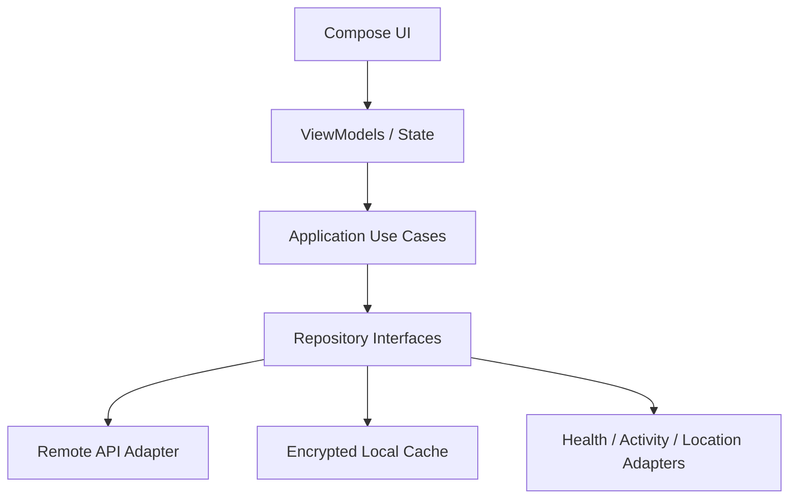

### Android responsibilities

- Mission discovery and selection
- Permission explanation and requests
- Explicit challenge start, pause, and stop
- Health Connect and activity-recognition reads
- Temporary route capture during eligible missions
- Local progress and offline submission queue
- Player profile, level, streak, teams, and rewards
- Receipt/bill capture with confirmation
- Clear evidence and carbon-result labels

### Android restrictions

- The device cannot mark an activity verified.
- The device cannot calculate authoritative rewards.
- The device cannot mutate point balances.
- Raw sensor readings are not treated as proof of trip purpose.
- Offline submissions remain pending until server verification.

### Web application responsibilities

- Campus and cohort configuration
- Quest templates and campaigns
- Reward catalogue and budget
- Evidence-review queue
- Factor/methodology workflow for authorized roles
- Privacy-safe dashboards
- Report generation and export
- Operational alerts and audit search

---

## 6. Domain Module Architecture

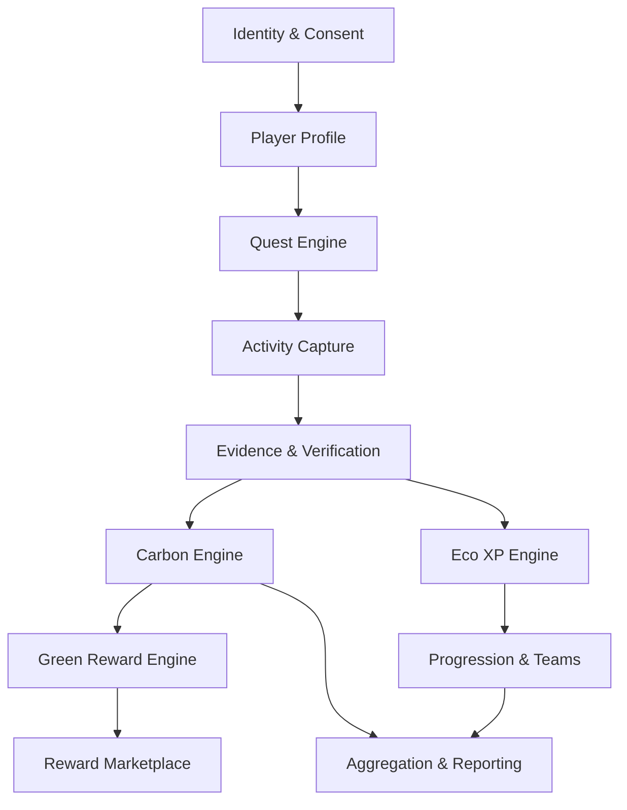

### Module responsibilities

| Module | Responsibilities | Prohibited responsibilities |
| --- | --- | --- |
| Identity | Authentication mapping, memberships, roles | Health or carbon processing |
| Consent | Purpose grants, withdrawal, policy versions | Bundled/implicit consent |
| Player profile | Level, preferences, privacy settings, baseline links | Editable point balance |
| Quest catalogue | Mission templates, eligibility, requirements, difficulty | Direct reward issuance |
| Quest runtime | Assignment, start/pause/complete, streak and event state | Verifying its own evidence |
| Activity capture | Normalize mobile, QR, bill, meter, or manual submissions | Claim environmental truth |
| Evidence | Provenance, hashes, storage references, status | Carbon arithmetic |
| Verification | Validity, duplication, plausibility, tier, review | Silent history overwrite |
| Factor registry | Sources, units, region, version, applicability | Unreviewed factor publication |
| Carbon engine | Baseline and actual calculations, uncertainty | LLM arithmetic or invented factors |
| Eco XP engine | Participation XP, caps, streak multipliers | CO2e claims or redeemable balance |
| Green reward engine | Eligible point issue/reversal | Client-controlled conversion |
| Progression | Levels, achievements, streaks, teams, boss progress | Raw location access |
| Marketplace | Catalogue, inventory, redemptions, fulfilment | Treating points as cash |
| Intervention | Cohorts, periods, observed and evaluated change | Unsupported causal claims |
| Reporting | Thresholded aggregates, exports, methodology | Default raw personal views |
| Audit | Sensitive state-change history | Secrets or raw evidence contents |

---

## 7. Primary Event Flow

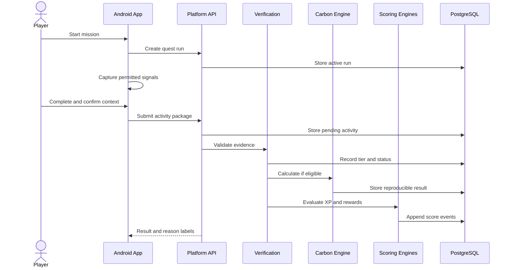

### Activity state machine

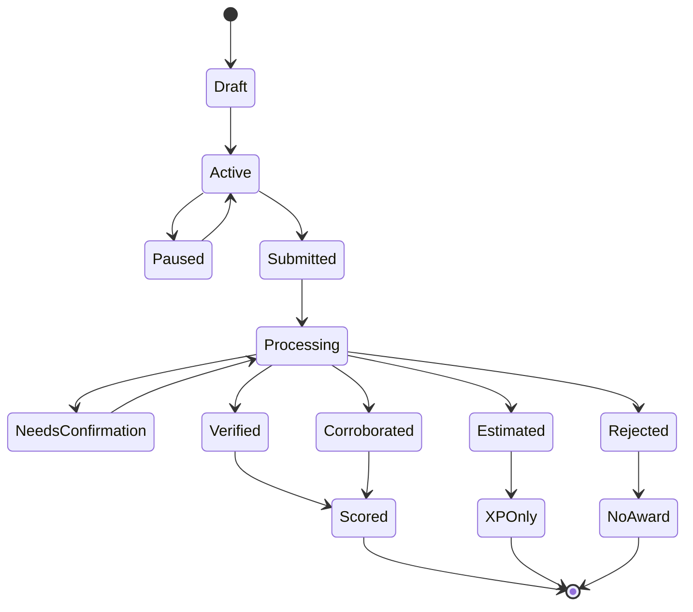

---

## 8. Tracking Architecture

### Signal hierarchy

Use the least invasive signal that can satisfy the mission:

1. Trusted campus or partner event
2. Health Connect aggregate or exercise session
3. Low-power activity-recognition state
4. GPS route during an explicitly active challenge
5. Bill, receipt, or meter evidence
6. User confirmation
7. Manual self-report as an estimated fallback

### Tracking modes

| Mode | Signals | Location | Typical use |
| --- | --- | --- | --- |
| Passive suggestion | Activity recognition, permitted aggregates | No continuous route | Suggest a possible mission completion |
| Active challenge | Activity state, elapsed time, distance | Optional route with consent | Walk/cycle/run mission |
| Issuer-verified | QR/NFC/server event | Route metadata from issuer | Shuttle or campus station |
| Document-based | Camera/upload, OCR | None | Bill, receipt, ticket |
| Manual | User-entered quantity | None | Estimated activity fallback |

### Active route lifecycle

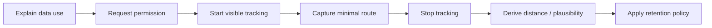

### Battery strategy

- Do not run continuous high-accuracy GPS.
- Use low-power movement detection for suggestions.
- Request route capture only for mission duration.
- Batch and compress route points where accuracy permits.
- Stop tracking on completion, timeout, cancellation, or lost permission.
- Show a persistent system notification while background route tracking is active.

---

## 9. Quest Architecture

### Quest template

```text
quest_template_id
title and description
category
eligibility rules
required consent purposes
required signals or evidence
minimum and maximum quantity
completion rule
base Eco XP
carbon eligibility rule
reward campaign reference
daily/repetition limits
start and end dates
version
status
```

### Quest runtime

```text
quest_run_id
player_id
quest_template_version
assigned_at
started_at
paused_at
completed_at
status
captured_activity_id
team_or_campaign_id
client_request_id
```

Quest templates are versioned. A quest run retains the version accepted when it began so later rule edits do not silently change its outcome.

### Quest types

- Distance target
- Duration target
- Mode replacement
- Trusted check-in
- Repeated habit
- Team contribution
- Cohort outcome
- Learning/event mission
- Evidence submission
- Time-boxed seasonal mission

---

## 10. Verification Architecture

### Evidence tiers

| Tier | Requirements | Examples | Carbon reward |
| --- | --- | --- | --- |
| V1 Verified | Trusted issuer or institution record | Shuttle QR, meter, partner transaction | Full eligibility |
| V2 Corroborated | Multiple consistent supporting signals | Health session + route/context; confirmed bill | Conditional |
| V3 Estimated | Plausible self-report or weak evidence | Manual commute | Normally none |
| V4 Rejected | Duplicate, impossible, replayed, manipulated | Reused QR, duplicate bill | None |

### Verification pipeline

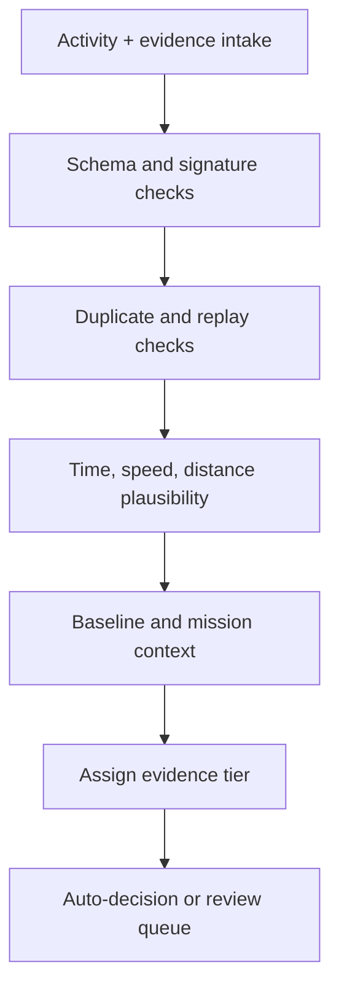

### Anti-fraud controls

- QR issuer signatures, short expiry, route binding, and nonce
- Idempotency keys for mobile submissions
- Content hashes for duplicate evidence
- Health/source provenance and timestamp consistency
- Plausibility thresholds by activity type
- Daily, category, route, device, and campaign limits
- Risk scoring for repeated high-value submissions
- Manual review for uncertain valuable claims
- Append-only verification changes and reward reversals
- Server-only privileged operations

Device signals increase confidence but do not prove that walking replaced a motorbike journey. Replacement context must come from a valid recurring baseline, an approved challenge design, trusted schedule/issuer evidence, or explicit confirmation with the appropriate evidence tier.

---

## 11. Carbon Calculation Architecture

### Calculation flow

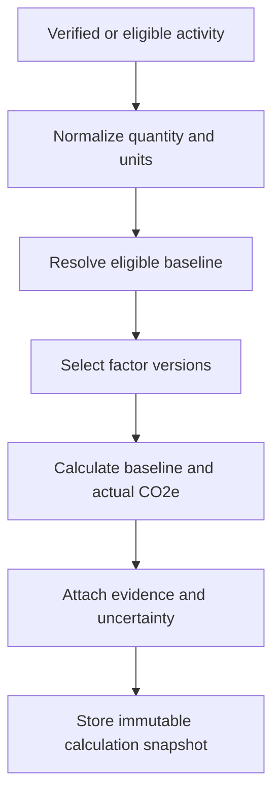

### Core formulas

```text
baseline_co2e = baseline_quantity × baseline_emission_factor
actual_co2e   = actual_quantity × actual_emission_factor
avoided_co2e  = max(0, baseline_co2e − actual_co2e)
```

### Factor priority

1. Institution- or supplier-specific measured factor
2. India-specific activity factor
3. Regional or sector-specific secondary factor
4. Clearly labelled international fallback
5. Spend-based estimate only when reliable activity data is unavailable

### Calculation record

```text
calculation_id
activity_id
baseline_id and snapshot
actual quantity and unit
baseline and actual factor snapshots
factor source, version, region, effective dates
methodology version
calculation-engine version
baseline, actual, and avoided kg CO2e
uncertainty or quality range
evidence tier
status and timestamp
```

Historical calculations never silently adopt a new factor. Recalculation produces a new record linked to the previous calculation and the reason for change.

---

## 12. Dual Scoring Architecture

### Eco XP engine

```text
eco_xp = base_xp
       × completion_quality
       × streak_multiplier
       × team_event_multiplier
```

Inputs include mission completion, activity quality, consistency, learning, and team contribution. XP events are append-only and capped.

### Green reward engine

```text
green_points = eligible_avoided_co2e
             × campaign_conversion_rate
             × evidence_multiplier
             × persistence_multiplier
```

The reward engine checks:

- Published campaign version
- Eligible baseline and positive avoided emissions
- Minimum evidence tier
- Daily/category/user/campaign cap
- Available sponsor or institution budget
- Duplicate or earlier issuance
- Reversal state

### Append-only events

```text
score_event_id
player_id
score_type: ECO_XP | GREEN_POINT
points_delta
reason_code
quest_run_id
activity_id
calculation_id
evidence_tier
campaign_version
issued_by
created_at
reversal_of_event_id
idempotency_key
```

Balances are computed from event sums or cached projections. A mutable balance column is never the authoritative ledger.

---

## 13. Progression and Social Architecture

### Progression records

- Player level derived from lifetime eligible Eco XP
- Achievement definition and achievement-award event
- Streak series with explicit time-zone and recovery rules
- Team membership with start/end dates
- Leaderboard snapshot rather than unrestricted live personal queries
- Boss-challenge aggregate progress

### Leaderboard privacy

- Individual leaderboards are opt-in.
- Public display uses chosen game names, not legal identity.
- Small campus cohorts are suppressed.
- Carbon results and fitness data are never exposed at individual level without explicit purpose and permission.
- Anti-fraud/review status is not publicly displayed.

### Boss challenge computation

Boss progress is derived from eligible aggregate events, not client-submitted progress values.

```text
boss_progress = sum(eligible verified contributions)
              / challenge target
```

Reversed contributions reduce progress through new aggregate events.

---

## 14. Reward Marketplace Architecture

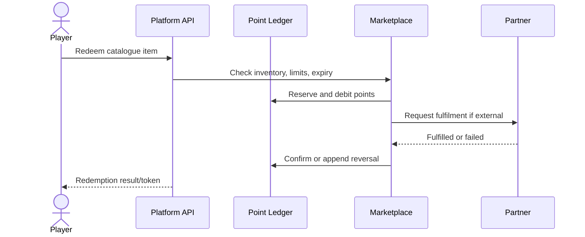

### Marketplace entities

- Reward partner
- Catalogue item and version
- Inventory or budget
- Eligibility and per-user limits
- Point price and validity
- Redemption
- Single-use token or fulfilment reference
- Expiration, cancellation, and reversal
- Settlement/reconciliation record for external partners

### MVP fulfilment

Use campus-managed catalogue items or mock single-use voucher codes. Arbitrary online purchasing and cash-equivalent conversion are excluded until commercial and regulatory requirements are validated.

---

## 15. Database Architecture

### Entity relationship overview

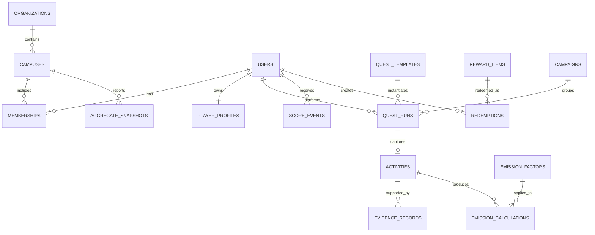

### Principal tables

| Table | Purpose |
| --- | --- |
| `organizations` | University or future tenant |
| `campuses` | Region, time zone, thresholds, and configuration |
| `users` | Minimal application identity mapping |
| `memberships` | Campus, role, and validity period |
| `player_profiles` | Game name, level projection, preferences |
| `consent_events` | Append-only consent history by purpose |
| `quest_templates` | Versioned mission definitions |
| `quest_runs` | Assigned and active player missions |
| `activity_events` | Captured movement, QR, document, or manual activity |
| `sensor_summaries` | Minimal submitted sensor-derived summary and provenance |
| `evidence_records` | Evidence source, reference, hash, tier, review state |
| `baselines` | Personal or cohort comparison reference |
| `emission_factors` | Versioned factor registry |
| `emission_calculations` | Immutable calculation snapshots |
| `score_events` | Append-only Eco XP and Green Point events |
| `achievements` | Versioned achievement definitions |
| `achievement_events` | Append-only unlock/reversal events |
| `teams` and `team_memberships` | Social grouping and membership validity |
| `campaigns` | Campus challenge, budget, period, and rules |
| `reward_partners` | Campus or external fulfilment partner |
| `reward_items` | Versioned reward catalogue and inventory |
| `redemptions` | Point debit and fulfilment lifecycle |
| `interventions` | Measurement design and cohort periods |
| `aggregate_snapshots` | Privacy-safe dashboard metrics |
| `jobs` | Background work queue |
| `audit_events` | Sensitive administrative/security history |

### Invariants

- Every tenant-owned row has an organization/campus boundary directly or through an immutable parent.
- Every score or redemption mutation is represented by an append-only event.
- Every carbon result references immutable factor and baseline snapshots.
- Every quest run retains the accepted template version.
- No client role can insert V1 evidence, emission calculations, score events, or fulfilled redemptions.
- Evidence deletion never changes an existing calculation silently.
- Aggregate outputs include privacy-threshold metadata.

---

## 16. API Architecture

### Player API

```text
GET    /api/player/profile
GET    /api/player/progress
GET    /api/quests
POST   /api/quest-runs
POST   /api/quest-runs/:id/pause
POST   /api/quest-runs/:id/complete
POST   /api/activities
POST   /api/activities/:id/confirm-context
POST   /api/evidence/upload
POST   /api/evidence/shuttle-checkin
GET    /api/emissions/summary
GET    /api/scores/ledger
GET    /api/teams
POST   /api/teams/:id/join
GET    /api/rewards/catalogue
POST   /api/rewards/redemptions
GET    /api/rewards/redemptions
POST   /api/consent
DELETE /api/consent/:purpose
```

### Campus API

```text
GET    /api/campus/overview
POST   /api/campus/campaigns
POST   /api/campus/quest-templates
GET    /api/campus/evidence-review
POST   /api/campus/evidence-review/:id/decision
POST   /api/campus/rewards
GET    /api/campus/reward-liability
POST   /api/campus/interventions
GET    /api/campus/reports/export
```

### Endpoint pipeline

Every write endpoint applies:

1. Authentication
2. Request and device/app-version validation
3. Tenant and role authorization
4. Consent/purpose check
5. Rate and abuse limits
6. Idempotency check
7. Transactional write
8. Audit event where sensitive
9. Deferred job creation where appropriate

Stable errors use a machine-readable code, safe user message, and opaque request ID.

---

## 17. Authorization and Privacy

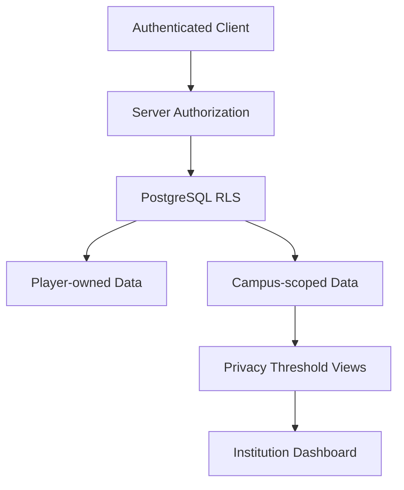

### Roles

| Capability | Player | Campaign admin | Evidence reviewer | Methodologist | Service role |
| --- | :---: | :---: | :---: | :---: | :---: |
| View own activity | Yes | No | Scoped evidence only | No | Audited |
| Submit own activity | Yes | No | No | No | No |
| Create campaign | No | Yes | No | No | Yes |
| Decide flagged evidence | No | No | Scoped | No | Yes |
| Publish factor/method | No | No | No | Yes | Yes |
| Issue/reverse points | No | No | No | No | Yes |
| View campus aggregates | No | Yes | Limited | Limited | Yes |

### Consent design

Store separate consent events for:

- Authentication/account
- Health/activity data
- Active route verification
- Bill/receipt evidence
- Personalization
- Teams and leaderboards
- Institutional aggregation
- Research/evaluation

Withdrawal prevents new processing for that purpose and starts the relevant retention/deletion workflow. It does not silently rewrite legally or methodologically required historical events.

### Data minimization

- Submit derived summaries rather than continuous raw sensor streams.
- Retain raw routes for the shortest approved period or avoid server retention where feasible.
- Keep evidence objects private and use short-lived signed access.
- Separate real identity from public game identity.
- Suppress small cohorts.
- Never log raw evidence, tokens, or unnecessary health/location fields.

---

## 18. Background Jobs

The MVP uses PostgreSQL as a job queue.

### Job types

- `verify_activity`
- `extract_document`
- `scan_uploaded_file`
- `calculate_emissions`
- `evaluate_scores`
- `refresh_progression`
- `refresh_aggregate_snapshot`
- `send_mission_notification`
- `fulfil_redemption`
- `expire_redemption`
- `delete_expired_evidence`
- `generate_report`

### Reliability rules

- Claim jobs with row locks.
- Use bounded retry with exponential backoff.
- Make each handler idempotent.
- Store attempts, failure reason, and next availability.
- Move repeatedly failing work to an operator-review state.
- Trace every job to its origin request/activity/redemption.
- Never issue a second score event when a retry occurs.

Add Temporal only when workflows become long-running, cross-service, and difficult to compensate with the database job model.

---

## 19. Offline and Synchronization

The Android application may lose connectivity during a challenge.

### Offline rules

- Store an encrypted local quest run and minimal activity summary.
- Assign a client-generated idempotency key at mission start.
- Record monotonic timestamps where possible.
- Queue completion until connectivity returns.
- Mark all offline results pending until server validation.
- Reject implausibly old, conflicting, or altered submissions.
- Merge only server-approved progression; never trust a local balance.

### Conflict handling

Server state is authoritative for quest status, evidence tier, calculations, score events, team progress, and redemptions. The client may preserve a local draft for user recovery but cannot overwrite a terminal server decision.

---

## 20. Deployment Architecture

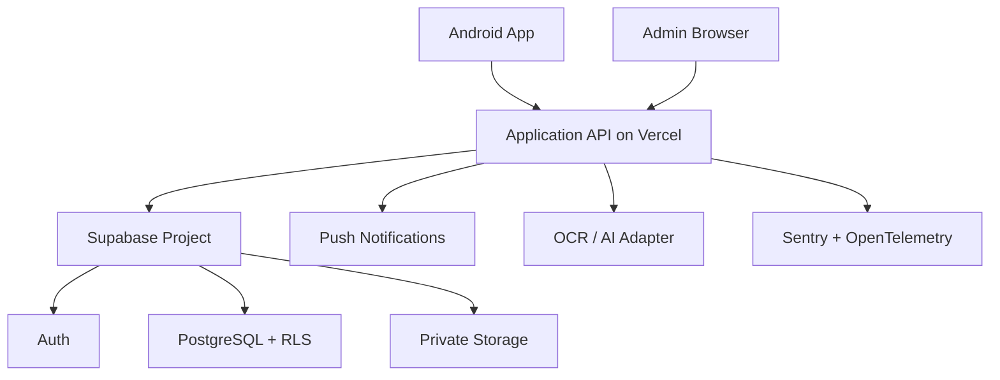

### Environments

| Environment | Purpose | Data policy |
| --- | --- | --- |
| Local | Development and tests | Synthetic data only |
| Preview | Web review and demo | Seeded/synthetic records |
| Staging | Mobile/API integration, migrations, security, UAT | Separate keys and tenant |
| Production | Approved campus pilot | Controlled personal data |

### Secrets

- Keep service-role, signing, partner, and provider secrets server-side.
- Android contains only public/mobile-safe configuration.
- Rotate QR issuer keys and partner credentials.
- Use separate credentials for every environment.
- Never commit `.env` or signing secrets.

---

## 21. CI/CD and Testing

### Build gates

1. Kotlin formatting, linting, compilation, and unit tests
2. TypeScript formatting, linting, type checking, and unit tests
3. Calculation fixture tests
4. Database migration and rollback validation
5. RLS and cross-tenant authorization tests
6. API integration tests
7. Android instrumented critical-flow tests
8. Web Playwright tests
9. Dependency, secret, and vulnerability scanning
10. Staging smoke test before production

### Critical test matrix

| Area | Required tests |
| --- | --- |
| Tracking | Permission denial, pause, timeout, route stop, offline completion |
| Health data | Duplicate sources, aggregate steps, revoked permission |
| QR | Expiry, forged signature, nonce replay, wrong route |
| Calculation | Units, factor dates, baseline selection, rounding, uncertainty |
| XP | Caps, streak time zone, repeated missions, reversal |
| Green points | Evidence threshold, idempotency, campaign budget, reversal |
| Marketplace | Insufficient balance, duplicate redemption, failure reversal |
| RLS | Cross-user, cross-campus, direct-table access denied |
| Privacy | Small cohorts suppressed, consent withdrawal, retention deletion |
| Extraction | Invalid schema, low confidence, confirmation correction |
| End-to-end | Walk mission, shuttle, reward, team progress, dashboard |

---

## 22. Observability

Monitor:

- API error rate and latency
- Mobile crash-free sessions
- Mission start, abandonment, and completion
- Sensor permission-denial and revocation rates
- Battery-impact reports and tracking timeouts
- Verification latency and review backlog
- QR replay and evidence-duplicate attempts
- Calculation errors by factor/method version
- XP/point issuance and reversal anomalies
- Redemption failure and outstanding liability
- Aggregate refresh delay
- Evidence-retention compliance

Audit at least:

- Consent grant and withdrawal
- Campaign and quest publication
- Factor/method publication
- Evidence decision changes
- Point issue and reversal
- Reward catalogue/inventory changes
- Redemption and fulfilment changes
- Report exports
- Privileged support access

---

## 23. Failure Handling

| Failure | Behaviour |
| --- | --- |
| Health permission denied | Explain impact; allow manual/QR missions |
| Activity recognition unavailable | Use explicit challenge tracking or manual fallback |
| GPS unavailable | Continue only if mission permits lower evidence; otherwise pause |
| Network unavailable | Save encrypted local draft; submit later as pending |
| QR replay | Return existing idempotent result or reject; no duplicate award |
| OCR provider unavailable | Queue retry and allow manual confirmed entry |
| Invalid AI extraction | Reject schema; require manual confirmation |
| Factor unavailable | Stop carbon calculation; mark `NEEDS_VERIFICATION`; never invent |
| Reward budget exhausted | Preserve XP/carbon result; issue transparent no-point reason |
| Partner fulfilment fails | Keep/reverse debit according to state machine |
| Evidence invalidated later | Append evidence change and score reversal |
| Cohort below privacy threshold | Suppress or combine where policy permits |
| Job retries exhausted | Move to operator review and alert |

---

## 24. Repository Structure

```text
carbonloop/
├── apps/
│   ├── android/
│   │   ├── app/
│   │   ├── core/
│   │   ├── feature-quests/
│   │   ├── feature-tracking/
│   │   ├── feature-progress/
│   │   └── feature-rewards/
│   └── web/
│       ├── app/
│       ├── components/
│       └── admin/
├── packages/
│   ├── schemas/
│   ├── domain/
│   ├── carbon-engine/
│   ├── factor-registry/
│   ├── quest-engine/
│   ├── verification/
│   ├── scoring/
│   ├── marketplace/
│   └── reporting/
├── workers/
├── supabase/
│   ├── migrations/
│   ├── policies/
│   └── seed.sql
├── tests/
│   ├── calculation-fixtures/
│   ├── integration/
│   └── e2e/
└── docs/
```

The domain packages must not import mobile or web UI code. Cross-module access should use published interfaces rather than internal file imports.

---

## 25. Architecture by Phase

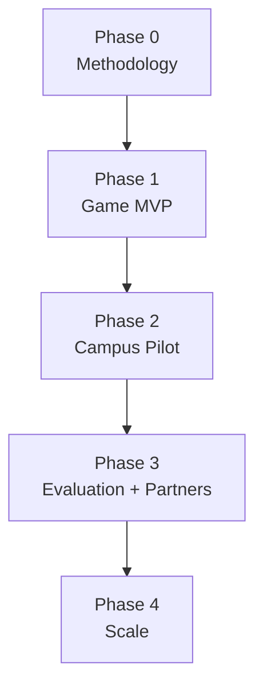

### [[Phase 0 - Methodology]]

- Emission-factor registry and calculation fixtures
- Initial baselines and evidence rules
- Quest, XP, Green Point, and reward policies
- Consent, retention, security, and fraud model
- Synthetic seed dataset

All real campus routes, issuer keys, factors, reward budgets, cohort thresholds, and approvals remain `NEEDS_VERIFICATION` until supplied and reviewed.

### [[Phase 1 - Game MVP]]

- Android onboarding and permissions
- Quest catalogue and runtime
- Walking mission or simulated tracking adapter
- Shuttle QR
- Carbon engine
- Dual score ledger
- Level, streak, and team progress
- Mock reward catalogue and redemption
- Next.js seeded campus dashboard

### [[Phase 2 - Campus Pilot]]

- Real campus configuration
- Trusted shuttle or station issuer
- Sponsor-backed reward inventory
- Evidence review and fraud monitoring
- Privacy-safe aggregate reports
- Production retention, backup, incident, and support processes

### [[Phase 3 - Evaluation and Partners]]

- Controlled intervention measurement
- Partner reward fulfilment
- iOS feasibility/implementation
- Reviewed causal evaluation only with sufficient data/design
- Methodology and security review

### [[Phase 4 - Multi-campus Scale]]

- Tenant onboarding and issuer management
- Additional activity and factor catalogues
- Partner-issued verifiable credentials when real portability is required
- Dedicated analytics or workflows only after measured triggers

---

## 26. Scaling Triggers

| Current component | Possible addition | Required trigger |
| --- | --- | --- |
| PostgreSQL aggregates | ClickHouse | Indexed/aggregated PostgreSQL repeatedly misses agreed targets |
| PostgreSQL job table | Temporal | Multi-step workflows need durable compensation and service coordination |
| Rules/catalogue | pgvector | Semantic discovery proves better at validated catalogue scale |
| TypeScript evaluation | Python/FastAPI + DoWhy/EconML | Approved causal methods and real pilot data require Python tooling |
| Signed QR/issuer record | W3C Verifiable Credentials | Independent issuers require portable third-party verification |
| Audit events | Merkle transparency log | External auditors require portable inclusion proofs |
| Modular monolith | Extracted service | Independent scaling, isolation, or ownership is demonstrated |

Excluded initially: Neo4j, InfluxDB, Qdrant, Redis, blockchain, federated learning, direct UPI ingestion, arbitrary e-commerce settlement, and unsupported live marginal-grid calculations.

---

## 27. Hackathon Reference Architecture

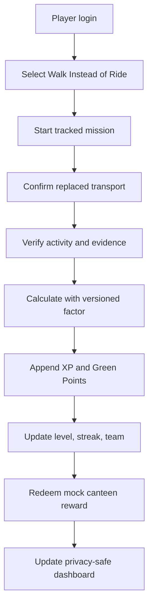

### Demo truth labels

- **Live:** Captured during the demonstration
- **Verified:** Accepted through approved evidence rules
- **Corroborated:** Supported but not issuer-verified
- **Estimated:** Based on self-report or weak evidence
- **Seeded:** Sample history, not a real participant
- **Projected:** What-if result
- **Simulated intervention:** Demonstration only, not causal evidence

---

## 28. Definition of Done

The architecture is working when:

- A player can start, pause, complete, and sync a mission.
- Every permission has a clear purpose and denial fallback.
- A completed exercise can earn XP without automatically creating CO2e savings.
- A transport-replacement mission records a baseline, factor, evidence tier, and reproducible result.
- The same submission cannot issue points twice.
- Clients cannot create verified evidence or score events directly.
- A redemption is atomic or safely reversible.
- Cross-user and cross-campus database access is denied.
- Small cohort data is suppressed.
- The dashboard distinguishes verified, corroborated, estimated, seeded, and projected values.
- OCR, GPS, or network failure has a safe fallback.
- The three-person team can operate and explain the full system.

---

## 29. Final Architecture Summary

> **CarbonLoop uses an Android-first player application, a Next.js institutional dashboard, one authenticated TypeScript platform API, Supabase PostgreSQL as the authoritative system of record, minimal mission-scoped activity tracking, evidence-tiered verification, deterministic carbon calculations, separate Eco XP and Green Point ledgers, a controlled reward marketplace, and privacy-thresholded campus reporting.**

This architecture preserves the fun of a daily-life game while ensuring that fitness activity, environmental impact, and financial rewards remain technically and ethically distinct.

---

## 30. Authoritative Technical References

- [Android Health Connect](https://developer.android.com/health-and-fitness/health-connect)
- [Health Connect workout experiences](https://developer.android.com/health-and-fitness/health-connect/experiences/workouts)
- [Health Connect exercise routes](https://developer.android.com/health-and-fitness/health-connect/features/exercise-routes)
- [Reading Health Connect data](https://developer.android.com/health-and-fitness/health-connect/read-data)
- [Android Activity Recognition API](https://developers.google.com/location-context/activity-recognition)
- [Apple HealthKit workouts and activity rings](https://developer.apple.com/documentation/healthkit/workouts-and-activity-rings)
- [Digital Personal Data Protection Act, 2023](https://www.meity.gov.in/static/uploads/2024/06/2bf1f0e9f04e6fb4f8fef35e82c42aa5.pdf)
- [Digital Personal Data Protection Rules, 2025](https://www.meity.gov.in/documents/act-and-policies/digital-personal-data-protection-rules-2025-gDOxUjMtQWa)
- [Central Electricity Authority CO2 Baseline Database](https://cea.nic.in/cdm-co2-baseline-database/?lang=en)
- [GHG Protocol Scope 3 Calculation Guidance](https://ghgprotocol.org/scope-3-calculation-guidance-2)
