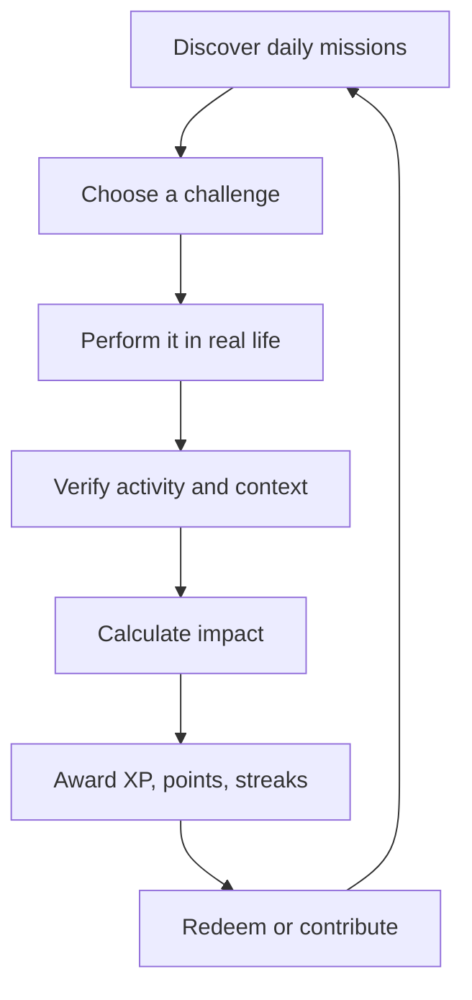
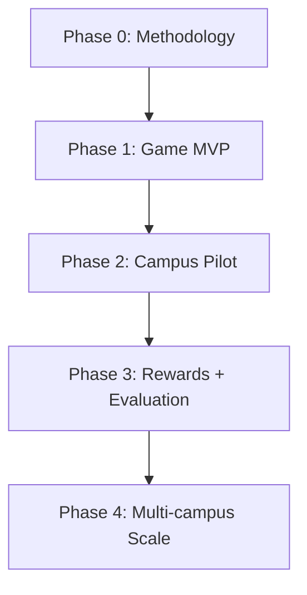

# CarbonLoop

## Real-World Sustainability Game and Campus Decarbonization Platform

**Tagline:** Play your day. Reduce your impact. Earn real rewards.  
**Short tagline:** Move. Verify. Reduce. Reward.  
**Team:** Hivemind — 3 members  
**Initial market:** Indian universities  
**Product model:** B2B2C — institutions purchase the platform; students and staff use it free  
**Technical specification:** [[CarbonLoop_Game_Architecture]]

**Architecture-pivot decision:** [ADR-0002: Android-First Game Architecture Pivot](decisions/ADR-0002-android-first-game-architecture-pivot.md) — proposed.

---

## 1. Executive Summary

CarbonLoop turns everyday sustainable behaviour into a real-world game. A user chooses a mission, performs it during the day, allows CarbonLoop to verify the activity, receives an evidence-backed carbon result, earns game progress, and redeems eligible points for campus or partner rewards.

The platform is not a game that asks the user to remain on a screen. The user's campus and daily routine become the game world:

> **Choose a mission → Act in real life → Verify the activity → Calculate impact → Earn points → Redeem rewards → Improve together**

Examples include walking or cycling instead of using a motorbike, taking a verified campus shuttle, lowering electricity consumption, sorting waste at a campus station, using refill facilities, or participating in a hostel energy challenge.

CarbonLoop deliberately separates general participation from environmental claims:

- **Eco XP** rewards healthy activity, challenge completion, consistency, teamwork, and game progress.
- **Green Reward Points** are redeemable and are issued only for eligible evidence-backed reductions.
- **Verified CO2e Saved** is the calculated environmental result, tied to a baseline, factor version, method, and evidence level.

This means exercise can make the experience fun without CarbonLoop falsely claiming that every calorie burned reduced carbon emissions.

### One-sentence pitch

> **CarbonLoop turns daily life into a verified sustainability game, rewarding people for real-world challenges while helping institutions measure which actions and interventions genuinely reduce emissions.**

---

## 2. The Problem

Carbon-awareness tools frequently fail because they require manual logging, produce abstract numbers, and provide little reason for users to return. Fitness applications successfully make movement measurable and habitual, but they usually do not connect activity to credible carbon accounting or institutional sustainability decisions.

Universities face a related problem. They may organize shuttle campaigns, car-free days, energy challenges, or waste drives but cannot reliably answer:

- Did participants change their behaviour or simply submit claims?
- What portion of the claimed impact has supporting evidence?
- Did walking replace a motorbike trip or was it only recreational exercise?
- How much CO2e was avoided, using which factor and methodology?
- Which intervention should receive the next sustainability budget?
- Can students receive rewards without creating an easily gamed system?

CarbonLoop addresses the engagement problem and the measurement problem together.

---

## 3. Product Vision

CarbonLoop should feel like a combination of:

- A real-world quest game
- A sustainability habit companion
- A fitness and mobility tracker
- An evidence-verification system
- A campus reward marketplace
- A privacy-safe institutional impact dashboard

The product should not require continuous active screen time. Users interact briefly to select missions, confirm uncertain context, review results, join team challenges, and redeem rewards. Low-power device signals and trusted campus evidence handle as much verification as possible.

### Product promise

For students and staff:

> Make sustainable behaviour visible, enjoyable, social, and rewarding.

For institutions:

> Turn participation into evidence-backed emissions and intervention insights.

---

## 4. Unique Selling Proposition

### Primary USP

> **India's real-world sustainability game that verifies daily actions, rewards credible reductions, and converts participation into privacy-safe campus decarbonization intelligence.**

### Why this is differentiated

| Capability | Fitness app | Carbon calculator | Reward challenge app | CarbonLoop |
| --- | :---: | :---: | :---: | :---: |
| Tracks movement | Yes | Rarely | Sometimes | Yes |
| Calculates carbon impact | No | Yes | Sometimes | Yes |
| Separates exercise from avoided emissions | No | Rarely | Rarely | Yes |
| Uses evidence tiers | No | Rarely | Limited | Yes |
| Provides redeemable rewards | Rarely | Rarely | Yes | Yes |
| Measures campus interventions | No | No | Limited | Yes |
| Versioned India-specific factors | No | Sometimes | Rarely | Yes |
| Privacy-safe institutional reporting | No | Limited | Limited | Yes |

The defensible product is not merely a points system. Its strength is the combined loop of **activity context, evidence, carbon methodology, game design, reward integrity, and institutional reporting**.

---

## 5. The Core Game Loop



### Example mission

**Mission:** Walk to class instead of taking a motorbike.

1. The user starts the mission.
2. CarbonLoop detects walking and records the challenge distance.
3. The user confirms that the journey replaced their normal motorbike trip.
4. The system checks time, distance, activity confidence, duplication, and route plausibility.
5. The carbon engine compares the eligible motorbike baseline with walking.
6. CarbonLoop stores the calculation factor, version, uncertainty, and evidence tier.
7. The player earns Eco XP, eligible Green Reward Points, and streak progress.
8. The campus team challenge receives a privacy-safe contribution.

Example result:

```text
MISSION COMPLETE

Distance walked:             2.1 km
Normal travel mode:          Motorbike
Estimated CO2e avoided:      0.18 kg
Evidence level:              Corroborated
Eco XP earned:               120
Green Reward Points earned:  18
Current streak:              5 days
Team contribution:           +1 verified journey
```

The values above are illustrative and must be replaced by an approved factor calculation before being presented as a real result.

---

## 6. Three Separate Measures

CarbonLoop must never combine fitness, participation, and carbon impact into one unexplained number.

### 6.1 Eco XP

Eco XP controls game progression. It may be awarded for:

- Completing a mission
- Walking, running, cycling, or exercising
- Maintaining a streak
- Participating in a team event
- Learning about sustainability
- Confirming data or improving evidence quality
- Helping a group challenge succeed

Eco XP is not money, carbon, or a verified environmental claim.

### 6.2 Green Reward Points

Green Reward Points are redeemable loyalty points. They are awarded only when:

- The action is eligible under a published reward rule.
- Evidence quality meets the minimum threshold.
- The activity produces a defensible reduction or an institution-approved outcome.
- Daily, category, repetition, and campaign limits are satisfied.
- The submission is not duplicated, replayed, manipulated, or implausible.

Green Reward Points are not carbon credits, offsets, or tradable environmental assets.

### 6.3 Verified CO2e Saved

This is a carbon-accounting result calculated as:

```text
Eligible avoided CO2e = baseline emissions − actual emissions
```

It must retain:

- Activity quantity and canonical unit
- Baseline type and eligibility
- Emission factor and unit
- Factor source, region, version, and effective dates
- Calculation method and engine version
- Evidence tier
- Uncertainty or quality range
- Calculation timestamp

---

## 7. Scoring Model

### Eco XP

```text
Eco XP = base mission XP
       × completion-quality multiplier
       × streak multiplier
       × team-event multiplier
```

Eco XP should be capped so that excessive sensor activity does not dominate progression.

### Carbon result

```text
Baseline emissions = baseline quantity × baseline factor
Actual emissions   = actual quantity × actual factor
Avoided CO2e       = max(0, baseline emissions − actual emissions)
```

### Green Reward Points

```text
Green Reward Points = eligible avoided CO2e
                    × campaign conversion rate
                    × evidence multiplier
                    × persistence multiplier
```

Suggested evidence multipliers:

| Evidence level | Description | Suggested multiplier |
| --- | --- | ---: |
| V1 — Verified | Campus QR, meter, authorized partner record | 1.00 |
| V2 — Corroborated | Sensor plus context, confirmed bill/receipt | 0.60–0.85 |
| V3 — Estimated | Plausible self-report | 0–0.20 |
| V4 — Rejected | Duplicate, manipulated, or invalid | 0 |

Exact conversion rates and caps remain `NEEDS_VERIFICATION` until the institution approves the reward budget and methodology.

---

## 8. Activity Catalogue

| Activity | Measurements | Eco XP | Green Points | Carbon condition |
| --- | --- | :---: | :---: | --- |
| Walking | Steps, distance, duration, activity confidence | Yes | Conditional | Replaces eligible motorized travel |
| Cycling | Distance, duration, speed, route confidence | Yes | Conditional | Replaces higher-emission travel |
| Running | Distance, duration, workout session | Yes | Usually no | Only if it replaces eligible travel |
| Exercise | Workout type, duration, consistency | Yes | No by default | Health benefit is not automatically carbon reduction |
| Campus shuttle | QR, route, time, issuer | Yes | Yes | Compared with eligible travel baseline |
| Bus or metro | Journey, route, ticket or confirmation | Yes | Conditional | Replaces higher-emission mode |
| Carpooling | Distance, vehicle type, occupancy | Yes | Conditional | Reduction against single-occupancy baseline |
| Electricity saving | kWh, period, meter/bill, normalized baseline | Yes | Yes | Measured reduction with appropriate normalization |
| Waste sorting | Station event, material, optional weight | Yes | Conditional | Approved waste methodology exists |
| Reusable refill | Station QR/NFC or partner record | Yes | Small capped reward | Approved displacement assumption exists |
| Sustainable meal | Canteen item/category | Yes | Conditional | Defensible factor and baseline exist |
| Stairs challenge | Floors or activity completion | Yes | Normally no | Impact too small/uncertain for initial carbon rewards |
| Learning quest | Quiz, workshop, campus event | Yes | Sponsor-defined only | Not recorded as avoided CO2e |
| Sleep or meditation | Duration and consistency | Wellness XP | No | No direct carbon claim |

### Rule for new activities

An activity can enter the reward catalogue only after documenting:

1. What behaviour is being changed?
2. What is the eligible baseline?
3. How is completion captured?
4. What evidence tier is possible?
5. Which factor and method calculate impact?
6. What uncertainty exists?
7. How can users game it?
8. What reward cap is financially sustainable?

---

## 9. Game Features

### Personal progression

- Player level and experience bar
- Daily, weekly, and seasonal missions
- Habit streaks with recovery rules
- Achievement badges
- Personal carbon budget
- Mission difficulty and evidence labels
- Avatar and profile customization
- Personal bests and milestone celebrations
- A timeline explaining how every point was earned

### Social and campus play

- Opt-in friends and squads
- Department, hostel, or house challenges
- Collaborative missions
- Privacy-safe leaderboards
- Campus exploration map
- Seasonal sustainability events
- Institution-sponsored campaigns
- Team rewards based on verified outcomes

### Boss challenges

A boss challenge represents a collective sustainability target rather than an enemy.

Examples:

- **Hostel Energy Boss:** Reduce normalized electricity consumption by 8% during the challenge period.
- **Car-Free Friday:** Complete 500 verified walking, cycling, public-transport, or shuttle journeys.
- **Waste Mountain:** Correctly sort a target quantity of campus waste through verified stations.
- **Green Campus Expedition:** Complete missions at approved sustainability locations.

Boss progress must be calculated from eligible aggregate records, not from raw user taps.

---

## 10. User Journeys

### 10.1 Daily player journey

1. User opens CarbonLoop and receives three relevant missions.
2. User selects one mission or joins a team challenge.
3. CarbonLoop explains required data, reward eligibility, and permissions.
4. User begins the real-world activity.
5. CarbonLoop monitors only the signals required for that mission.
6. User confirms context when the device cannot infer it reliably.
7. The platform verifies, calculates, and labels the result.
8. User receives Eco XP, eligible Green Points, and progress feedback.
9. User can redeem, save, or contribute points.

### 10.2 Walking replacement journey

1. Select **Walk Instead of Ride**.
2. Choose the usual baseline mode or use an approved recurring baseline.
3. Start tracking.
4. Detect walking and distance; use route recording only with permission.
5. Complete the challenge and check plausibility.
6. Calculate the eligible avoided CO2e.
7. Apply evidence multiplier and reward limits.

### 10.3 Shuttle journey

1. Scan a rotating QR inside the shuttle.
2. Validate the route, issuer, validity window, and nonce.
3. Create a V1 verified journey.
4. Compare the shuttle with the eligible personal baseline.
5. Issue rewards through the server-side ledger.

### 10.4 Electricity challenge

1. Join a personal or hostel challenge.
2. Upload a bill or use approved meter information.
3. Confirm extracted kWh and billing dates.
4. Compare with an appropriate weather/calendar-normalized baseline where available.
5. Award points only after the measurement period closes.

### 10.5 Reward redemption

1. Open the reward marketplace.
2. Select an available campus or partner reward.
3. Check balance, limits, inventory, and expiry.
4. Create an append-only point debit.
5. Issue a single-use redemption token or partner fulfilment request.
6. Record fulfilment, expiry, cancellation, or reversal.

---

## 11. Reward Marketplace

### MVP rewards

- Campus canteen discount or free item
- College merchandise
- Event, workshop, or sports pass
- Printing credits
- Library or facility benefit
- Campus shuttle benefit
- Sponsor discount code
- Sustainable product
- Point donation to a campus project
- Recognition certificate or profile cosmetic

### Post-pilot possibilities

- Merchant gift cards
- Public-transport benefits
- Wider e-commerce partner catalogue
- Sponsor-funded seasonal campaigns
- Corporate employee benefit marketplace

CarbonLoop should not initially promise that points can buy arbitrary items on any website. That requires merchant contracts, settlement, refunds, fraud operations, tax/accounting review, and sufficient reward funding.

### Economic model

- The institution or sponsor funds redeemable inventory.
- CarbonLoop defines limits and fraud controls.
- Points are a closed-loop loyalty unit, not money.
- CarbonLoop never guarantees a fixed cash or carbon-credit conversion.
- Reward liability and expiration are visible to administrators.

---

## 12. Verification and Anti-Cheating

### Evidence tiers

| Tier | Label | Examples |
| --- | --- | --- |
| V1 | Verified | Rotating shuttle QR, meter data, campus/partner record |
| V2 | Corroborated | Sensor activity plus plausible context, confirmed bill or receipt |
| V3 | Estimated | User-reported activity without strong supporting evidence |
| V4 | Rejected | Duplicate, replayed, impossible, manipulated, or policy-ineligible |

### Controls

- Rotating signed QR payloads
- Short validity windows and nonce replay protection
- Sensor/source provenance
- Content hashes for duplicate files
- Plausible speed, time, distance, and frequency ranges
- Idempotency keys for submissions, rewards, and redemptions
- Daily and category reward caps
- Device and account risk signals
- Manual review for high-value uncertain claims
- Append-only reversals instead of silent deletion
- Server-only reward issuance
- Transparent no-award reason codes

Walking in circles may still earn limited Eco XP, but it must not earn avoided-carbon rewards unless a defensible trip replacement is established.

---

## 13. Monitoring and Privacy

CarbonLoop must not continuously store precise location throughout the day.

### Recommended monitoring model

- Read aggregated steps or exercise sessions with permission.
- Use low-power activity recognition to suggest walking, cycling, or vehicle states.
- Activate GPS only during an explicitly started route challenge.
- Use campus QR/NFC or partner events when they provide stronger evidence.
- Ask the user to confirm uncertain baseline or trip purpose.
- Store the derived distance and verification result where possible instead of indefinite raw routes.
- Provide a visible pause-tracking control.
- Let the user review permissions, withdraw consent, and request deletion.

Android Health Connect supports activity data such as steps and exercise sessions, and route access is separately permission-controlled. Android's Activity Recognition API uses device sensor signals to detect movement states. Apple's HealthKit offers workout summaries and outdoor workout routes with user authorization.

### Consent purposes

Separate consent should be used for:

- Account and authentication
- Activity and fitness records
- Route-based challenge verification
- Bills, receipts, or meter evidence
- Personalized recommendations
- Social or leaderboard participation
- Institutional aggregate reporting
- Research or causal evaluation

The platform must follow applicable Indian data-protection requirements, including purpose limitation, data minimization, understandable notice, reasonable security, and accessible withdrawal.

---

## 14. Institutional Dashboard

The campus dashboard should show:

- Active users and retention
- Mission participation and completion
- Verified, corroborated, and estimated shares
- Aggregate emissions by category
- Eligible avoided CO2e
- Reward issuance and redemption liability
- Team and intervention performance
- Data-quality score
- Privacy-safe cohort comparison
- Methodology and factor versions
- Uncertainty and coverage
- Exportable pilot report

Administrators should see aggregates by default. Department or hostel results appear only when a configurable minimum cohort threshold is satisfied.

---

## 15. Target Users and Buyers

### Players

- Students
- Faculty
- Campus staff
- Hostel residents

### Buyers and operators

- Sustainability or environment office
- Student affairs department
- Facilities and operations team
- Campus transport office
- Institutional leadership

### Partners

- Canteens and campus merchants
- Public-transport or shuttle operators
- Waste-management providers
- Fitness and sports facilities
- Sustainable brands and sponsors

---

## 16. Business Model

### Primary model

Annual campus subscription covering:

- Platform access
- Administrator dashboard
- Campaign and quest configuration
- Factor and methodology management
- Aggregate reporting
- Standard support

### Additional revenue

- Setup and campus integration
- Premium reporting and methodology support
- Sponsored challenges
- Reward-marketplace service fee where appropriate
- Multi-campus enterprise plan
- Corporate-campus product after university validation

Students should not pay for core participation. Reward inventory should be funded by the campus or sponsors rather than by uncontrolled CarbonLoop expenditure.

---

## 17. MVP Scope

### Hackathon build

Build one complete journey plus supporting screens:

1. Player onboarding and consent
2. Seeded transport baseline
3. Mission selection
4. Walking challenge tracking or simulated sensor adapter
5. Shuttle QR verification
6. Versioned carbon calculation
7. Eco XP and Green Point result
8. Player level and streak
9. Mock canteen reward redemption
10. Privacy-safe campus dashboard update
11. What-if scenario screen

All seeded, simulated, projected, and real records must be visibly distinguished.

### Do not build for the hackathon

- Arbitrary e-commerce purchasing
- Cash withdrawal of points
- Tradable carbon credits
- Always-on GPS tracking
- Direct UPI ingestion
- Full iOS and Android parity
- Blockchain
- Federated learning
- Five-database architecture
- Unsupported causal or live-grid claims

---

## 18. Implementation Roadmap



### Phase 0 — Methodology and foundation

- Approve initial categories and baselines.
- Build the versioned emission-factor registry.
- Create deterministic calculation fixtures.
- Define evidence, reward, fraud, retention, and consent policies.
- Mark unavailable campus inputs as `NEEDS_VERIFICATION`.

### Phase 1 — Game MVP

- Android-first player experience
- Quest catalogue and progression
- Walking challenge and shuttle QR
- Eco XP, Green Point ledger, and mock rewards
- Personal dashboard
- Seeded institutional dashboard

### Phase 2 — Campus pilot

- 100–300 participants in one campus cohort
- Real shuttle route or one transport intervention
- One electricity or waste intervention
- Sponsor-backed reward catalogue
- Evidence review, privacy thresholds, monitoring, and support

### Phase 3 — Rewards and evaluation

- Partner fulfilment integration
- Controlled intervention evaluation
- Confidence intervals and data-quality reporting
- Methodology review
- Retention and fraud analysis

### Phase 4 — Scale

- Multi-campus onboarding
- iOS support
- Additional evidence issuers
- Corporate-campus product
- Advanced analytics infrastructure only when measured load justifies it

---

## 19. Pilot Success Metrics

### Engagement

- Weekly active participants
- Mission-start-to-completion rate
- 7-day and 30-day retention
- Average active streak
- Team challenge participation

### Evidence quality

- Percentage of rewarded actions at V1 or V2
- Duplicate/replay rejection rate
- Manual-review rate
- Sensor-to-user-confirmation correction rate

### Environmental quality

- Factor coverage and version completeness
- Percentage of results with explicit baseline
- Eligible avoided CO2e by evidence tier
- Uncertainty and missing-data rate

### Marketplace

- Reward redemption rate
- Sponsor/campus cost per retained participant
- Point liability and expiration
- Fraud and reversal rate

### Institutional value

- Time required to create a campaign
- Time required to generate a report
- Number of actionable intervention decisions
- Administrator satisfaction

Suggested pilot gates:

- A mission can be started in under 20 seconds.
- At least 60% of redeemable rewards come from V1 or V2 evidence.
- Administrators generate a useful report in under 10 minutes.
- No serious cross-user or cross-campus privacy failure occurs.
- At least one intervention yields a defensible observed improvement.

---

## 20. Key Risks and Mitigations

| Risk | Mitigation |
| --- | --- |
| Users farm steps without reducing emissions | Separate Eco XP from carbon rewards; require replacement context |
| GPS drains battery | Use low-power recognition; GPS only during active route missions |
| Health/location privacy concerns | Purpose-specific consent, minimal collection, pause control, short retention |
| Fake QR or replay | Signed rotating payload, expiry, nonce, rate limit |
| Reward cost becomes unsustainable | Sponsor/campus funding, caps, inventory, campaign budgets |
| Exercise creates false carbon claims | Exercise earns XP only unless a valid displacement is demonstrated |
| Generic factors reduce credibility | Versioned India-specific hierarchy and visible quality labels |
| Team compares tiny cohorts | Minimum cohort threshold and suppression |
| Users lose motivation | Short missions, team goals, meaningful rewards, varied progression |
| Causal impact is overstated | Label observed, projected, and causal results separately |
| Too much infrastructure slows the team | Modular monolith and PostgreSQL-first architecture |

---

## 21. Product Language

Use:

- Eco XP
- Green Reward Points
- Estimated or verified CO2e saved
- Evidence-backed activity
- Projected scenario
- Observed change
- Campus sustainability challenge

Avoid:

- Carbon burned
- Guaranteed carbon saving
- Carbon credit for loyalty points
- Zero-emission person
- Real-time verified carbon when only estimates exist
- Causal impact without an approved evaluation

“Carbon burn” can be used as playful internal language only if the interface clearly explains the real metric. The public product should use **avoided emissions** or **CO2e saved**.

---

## 22. Final Demonstration Story

The strongest demonstration is:

1. A student opens CarbonLoop and chooses **Walk Instead of Ride**.
2. The app explains which signals will be used.
3. The student completes a tracked walking mission.
4. CarbonLoop verifies activity and baseline context.
5. A versioned factor calculation produces an evidence-labelled result.
6. The student gains Eco XP, a streak, and eligible Green Points.
7. A campus team challenge advances.
8. The student redeems a mock canteen reward.
9. The institution sees only the privacy-safe aggregate contribution.
10. The dashboard compares verified, corroborated, and estimated results.

This single flow demonstrates the game, tracking, carbon methodology, verification, rewards, privacy, and institutional value.

---

## 23. Final Product Definition

> **CarbonLoop is an Android-first real-world sustainability game and campus decarbonization platform. It turns daily missions into evidence-backed activity records, separates wellness progress from credible carbon reduction, rewards eligible outcomes through a controlled marketplace, and gives institutions privacy-safe insight into which interventions work.**

---

## 24. Authoritative Technical and Policy References

- [Android Health Connect](https://developer.android.com/health-and-fitness/health-connect)
- [Health Connect data types](https://developer.android.com/health-and-fitness/health-connect/data-types)
- [Reading Health Connect data](https://developer.android.com/health-and-fitness/health-connect/read-data)
- [Android Activity Recognition API](https://developers.google.com/location-context/activity-recognition)
- [Apple HealthKit workouts and activity rings](https://developer.apple.com/documentation/healthkit/workouts-and-activity-rings)
- [Digital Personal Data Protection Act, 2023](https://www.meity.gov.in/static/uploads/2024/06/2bf1f0e9f04e6fb4f8fef35e82c42aa5.pdf)
- [Digital Personal Data Protection Rules, 2025](https://www.meity.gov.in/documents/act-and-policies/digital-personal-data-protection-rules-2025-gDOxUjMtQWa)
- [Central Electricity Authority CO2 Baseline Database](https://cea.nic.in/cdm-co2-baseline-database/?lang=en)
- [GHG Protocol Scope 3 Calculation Guidance](https://ghgprotocol.org/scope-3-calculation-guidance-2)
